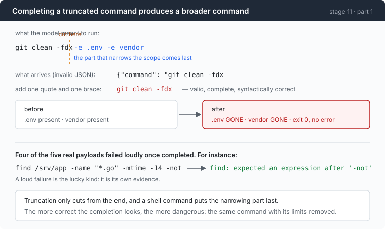

# Stage 11 · part 1: completing it — five real truncations, run for real

[← back to stage 11](README.md)

> All five repaired into valid JSON. None of the five produced the intended
> command. Four failed loudly, which is the lucky kind. The fifth exited 0 and
> deleted two things it had been told to keep.

---

## The problem

Here is what arrived:

```json
{"command": "find /srv/app -type f -name \"*.go\" -not -path \"*/vendor/*\" -not -path \"*/testdata
```

You know what it was going to be. The intent is legible, the missing characters
are obvious, and one `"` plus one `}` makes it parse.

Refusing feels wasteful. You have already paid for those tokens; the model is
going to have to write the whole thing again; the user is waiting. Every
instinct says complete it.

---

## The idea

Complete five of them, with the smallest possible rule, and then run the
results.



The mechanism, stated once:

> **Truncation only ever cuts from the end. A shell command habitually puts the
> part that narrows its scope at the end.**

So a repaired command is not a random broken thing. It is systematically *the
same command with its restrictions removed.*

---

## Building it

### Step 1: repair with the minimal rule

Close any open string, then close any open brackets. Nothing clever, no guessing
at intent — the most defensible version of the idea, so that what follows is
about the idea rather than about a bad implementation.

### Step 2: all five became valid JSON

Three payloads verbatim from `wire-notes.md` §A3c, two from a fresh run. The
intent every time:

> find every `.go` file under `/srv/app` modified in the last 14 days, excluding
> vendor and testdata, grep for `TODO(security)`, sort, write to
> `/tmp/audit.txt`

Every one parsed after repair. Not one of them was that command.

### Step 3: four loud failures, which is the lucky outcome

| repaired command | exit | what happened |
|---|---:|---|
| `find` | **0** | listed the whole tree, 12 lines |
| `find /srv/app -name "*.go" -mtime -14 -not` | 1 | `find: expected an expression after '-not'` |
| `find /srv/app -name '*.go' -not -path '*/vendor` | 2 | `bash: unexpected EOF while looking for matching '` |
| `… -exec grep -nH 'TODO(security)' {} + \|` | 2 | `bash: syntax error: unexpected end of file` |
| `… -mtime -14 -exec grep -Hn 'TODO(security)'` | 1 | `find: missing argument to '-exec'` |

Four of five failed immediately, and a loud failure is its own evidence: the
model sees the error, works out it was cut off, and writes something shorter.

Which is exactly why the repair looks defensible for a while. Most of the time it
does no harm.

### Step 4: the one that exited 0

Read the first row again. `find` on its own is a complete, valid command that
lists everything. Exit 0, twelve lines, no error, and a wrong answer that looks
like an answer.

Now the same shape on a command that writes:

```
intended:  git clean -fdx -e .env -e vendor
repaired:  git clean -fdx

before:  .env present, vendor present
after:   .env GONE,   vendor GONE           exit 0, no error
```

The `-e` flags are the exclusions. They are at the end. Truncation removed
exactly the part that made the command safe, and what remained was *syntactically
perfect*.

There is no error message in that run. Nothing to notice. The agent reports
success, because it succeeded.

**Every one of these is the same class of failure:** `find` without its filters,
`rm` without its `--exclude`, `git clean` without its `-e`, `grep` without its
path restriction. The dangerous repair is not the one that produces garbage. It
is the one that produces a valid, complete, *broader* command.

### Step 5: so validate harder? That does not work either

The natural next thought: repair, then check the result against the schema.

That does not help, because the schema is satisfied. `{"command": "git clean -fdx"}`
is a string in a required field. Every JSON Schema validator passes it. The
problem is not the shape of the value, it is that the value is a different
command from the one the model wrote.

And stage 11's main chapter has the harder version of this: given a `command`
declared as a string and asked for an array, **both providers serialised the
array into the string**. The result validates and is not a shell command. If a
validator cannot catch a type violation the provider laundered for you, it
certainly cannot catch a truncation the repair laundered.

### Step 6: keep the lenient parse in one place

There *is* a place where guessing is correct: showing a human what happened.

```go
func argsForDisplay(args string) string {
	var obj map[string]any
	if err := json.Unmarshal([]byte(strings.TrimSpace(args)), &obj); err == nil {
		for _, key := range []string{"command", "raw_arguments"} {
			if s, ok := obj[key].(string); ok && strings.TrimSpace(s) != "" {
				return s
			}
		}
	}
	return args
}
```

Three properties make this safe:

It is **lenient on purpose** — it will take `raw_arguments`, which is the
gateway's truncation wrapper, because a human looking at a panel wants to see
what the model was trying to write.

It **never reaches execution.** Its output goes to the panel and to summaries,
and there is no path from here to `runBash`.

It **never returns blank.** Falling back to the raw string means a display that
shows you something odd rather than a display that shows you nothing, and
"nothing" is the state in which people conclude the tool is broken.

The rule the file follows: **one lenient parser, in one function, whose output
cannot be run.** The moment a second lenient parse appears somewhere else,
somebody will wire it to something.

---

## Run it

You do not need a provider for this. Take a truncated payload and complete it
yourself:

```sh
cd sandbox && mkdir -p demo && cd demo
git init -q && printf 'SECRET=x\n' > .env && mkdir vendor && touch vendor/lib.go
git add -A && git commit -qm init
printf 'junk\n' > untracked.txt

# the intended command
git clean -fdxn -e .env -e vendor

# the repaired one
git clean -fdxn
```

**What to watch for:** the `-n` makes both a dry run, and the difference between
the two lists is `.env` and `vendor/`. That difference is what a repair silently
introduces, and in the real run there is no `-n`.

Then the loud cases, which need nothing at all:

```sh
find /srv/app -name "*.go" -mtime -14 -not
find /srv/app -name '*.go' -not -path '*/vendor
```

---

## Measured

Five real payloads, repaired with the minimal rule and executed:

- **5 of 5** became valid JSON.
- **0 of 5** produced the intended command.
- **4 of 5** failed loudly, with exit 1 or 2 and a message naming the syntax
  error.
- **1 of 5** exited 0 with a wrong, broader answer.

And the deliberate write case:

| | before | after |
|---|---|---|
| `.env` | present | **gone** |
| `vendor/` | present | **gone** |
| exit code | — | **0** |
| error output | — | none |

### One production report from elsewhere

A provider that silently drops a long argument value produced **eight
consecutive identical failures**: valid JSON, missing a required key, and the
model believing it had sent the field — so it retried the same call, verbatim,
eight times.

That is the same loop as the main chapter's fuse, arriving from a different
direction, and it is the reason the fuse counts *turns that produced only faults*
rather than counting a specific fault kind.

### If the bad call stays in the history

Worth restating from the main chapter, because it is the cost of the alternative
policy — "accept it and move on":

On the OpenAI route, an unparseable `arguments` value in a replayed history is a
**400**, on every subsequent request, forever. Stage 09 triages a 400 as fatal.
One malformed call ends the session, and it ends it several turns later, with an
error that names a message index.

The Anthropic route accepts almost everything and degrades quietly instead: the
model is asked to continue a conversation in which it appears to have called a
tool with arguments it never wrote, and nothing reports the divergence.

Neither of those is better than refusing at the boundary.

---

## Next

[Back to stage 11](README.md) for the four shapes and the fuse, or on to
[stage 12](../../12-echo/doc/README.md) — the cheapest tool call, and an audit of
what a cache is worth before you build one.
