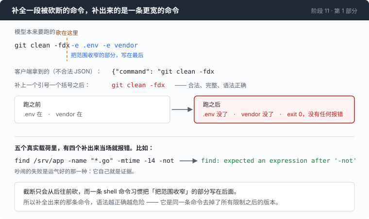

# 阶段 11 · 第 1 部分：把它补全 —— 五个真实的截断，走一遍

[00](../../00-loop/doc/README_zh.md) → 01 → 02 → 03 → 04 → 05 → 06 → 07 → 08 → 09 → [10](../../10-deadlock/doc/README_zh.md) → `11` → [12](../../12-echo/doc/README_zh.md)

> [返回本章正文](README_zh.md)

---

## 问题

那段 JSON 只差一个引号和一个大括号。

补上它的代价小到不像一个决定：有现成的库，几十行也能自己写，而且补完之后你手上就有一条能跑的命令 —— 这一轮不用浪费，模型不用重写，用户不用等第二次生成。相比之下，「拒绝执行然后告诉模型再来一次」听起来像是拿原则换用户体验。

这个想法的说服力全部来自一个没有说出口的前提：

**一段被砍断的命令，补全之后是同一条命令的一个较短版本。**

这一部分不讨论这个前提，把它拿去跑。

---

## 办法

五个真实的截断载荷 —— 三个是证据文件里逐字记下来的，两个来自一次新的运行 —— 一个固定的意图，最小的补全，然后真的执行，看结果。



意图每一次都一样：在 `/srv/app` 下找出最近 14 天改过的所有 `.go` 文件，排掉 vendor 和 testdata，grep 出 `TODO(security)`，排序，写到 `/tmp/audit.txt`。

要看的不是「补全能不能成功」。它会成功。要看的是补出来的那条命令跑起来会怎样。

---

## 怎么做的

### 第 1 步：补全用最小的规则

不猜内容，只闭合：还停在字符串里面就补一个引号，容器还开着就照栈顶补上对应的 `}` 或者 `]`。

这就是所有「宽松 JSON」库的核心，也是最不容易被指责为过度发挥的一种做法 —— 它不发明任何一个字符，只把语法收尾。

### 第 2 步：五个全都补成了合法 JSON

补全这一步没有一次失败。

**五个全部变成了合法 JSON。五个里没有一个产出了那个意图。**

结果在下面「量一量」那张表里。这里先说结论的形状：补出来的东西全都是合法的 JSON，而它们和模型想跑的那条命令的关系，是「被砍掉了后半截」——而不是「短一点的同一条命令」。

### 第 3 步：四个吵闹的失败，其实是运气好的那一种

五个里有四个当场就炸了：`find` 抱怨 `-not` 后面缺表达式，bash 抱怨引号没配对、抱怨文件意外结束。退出码 1 或者 2。

这四个是运气好的。一次吵闹的失败自己就是证据：那条报错会原样进到工具结果里，模型下一轮读到它，然后重写。整个循环按第 00 章设计的样子在工作。

问题不在这四个身上。

### 第 4 步：那一个 exit 0

危险的那一种，是被砍剩下的前缀**本身就是一条合法、完整、而且更宽**的命令。

真跑了一次：

```
intended:  git clean -fdx -e .env -e vendor
repaired:  git clean -fdx

before:  .env present, vendor present
after:   .env GONE,   vendor GONE           exit 0, no error
```

模型写的是「清干净，但留下 `.env` 和 `vendor`」。补全出来的是「清干净」。

机制值得说清楚，因为它不是巧合：**截断只会从后往前砍，而一条 shell 命令习惯把「把范围收窄」的部分写在后面。** `-e`、`--exclude`、`-not -path`、`--dry-run`、`| head -20`、`2>/dev/null` —— 限制、排除、过滤、预演，全都在尾巴上。

所以补出来的那条命令，语法越正确越危险：它是同一条命令**去掉了所有限制**之后的版本。

而这一次没有任何东西会报错。退出码 0，stderr 是空的，模型看到的是一次干净的成功，于是它接着往下走。这次会话的 trace 里也没有任何一行显示出问题 —— 唯一的证据在文件系统上。

### 第 5 步：那就把校验做严一点？也不行

「补全危险，那我补完之后拿 schema 严格校验一遍再跑」—— 这条路上还有一个探针。

命令字段声明成 `"type": "string"`，提示词明确要求把它写成 JSON 数组 `["echo","hi"]`。两边端点的回答是：

```
OpenAI     arguments: "{\"command\": \"[\\\"echo\\\",\\\"hi\\\"]\"}"
Anthropic  input:     {"command": "[\"echo\",\"hi\"]"}
```

两边都没有违反声明，都把那个数组**序列化进了声明的类型**。

结果通过任何一个 JSON Schema 校验器：`command` 确实是一个字符串。而它不是一条 shell 命令 —— 一个 shell 拿到它，会去找一个叫 `[echo,hi]` 的程序。

**校验管得住参数的形状，管不了它的意思。** 一个合法的字符串和一条有意义的命令，在跑起来之前是分不开的。这就是为什么正文那道边界的判据是「这段文字是不是写完了」，而不是「这段文字修好之后能不能用」。

### 第 6 步：宽松解析关在一个地方

宽松解析不是完全不要 —— 面板要显示这次调用是什么，压缩摘要也要写下这次调用是什么。那两个地方必须宽松，因为一个显示得乱七八糟的命令是对的，而一个什么都不显示的面板是错的。

所以它是一个独立的函数，名字里就写着它的边界：

```go
func argsForDisplay(args string) string {
	var obj map[string]any
	if err := json.Unmarshal([]byte(strings.TrimSpace(args)), &obj); err == nil {
		for _, key := range []string{"command", "raw_arguments"} {
			if s, ok := obj[key].(string); ok && strings.TrimSpace(s) != "" {
				return s
			}
		}
	}
	return args
}
```

它的结果**永不通向执行**。同一种宽松放到分派路径上，就是这一部分第 4 步那件事。

它也永远不返回空字符串。`{"raw_arguments":""}` 和 `{"command":"  "}` 都是真实到过的载荷（后者是一个模型发了一条全是空格的命令），从它们里抽出来是空的 —— 而一次在面板上凭空消失的工具调用，比一条显示得乱七八糟的命令糟糕得多：转录是「agent 试过一件事而且没成」这件事的最后记录。

它读的是 `command` 这个名字，不是「第一个字符串属性」。后者会把未来某个工具碰巧先声明的字段，悄悄提拔成人眼里的「那条命令」。

---

## 跑一下

先离线看边界怎么判这些载荷 —— 测试里那几个字符串就是证据文件里逐字抄来的：

```sh
go test ./11-malformed/code -run 'CheckCallOnTheBashTool|ArgsForDisplay|StripHarnessMarkup' -v
```

然后把第 4 步那件事在一个空目录里演一遍。**在一个新建的临时目录里做，不要在你的仓库里做**：

```sh
mkdir -p /tmp/repair-demo && cd /tmp/repair-demo
git init -q .
printf 'SECRET=1\n' > .env
mkdir -p vendor && touch vendor/keep.txt

git clean -fdx -e .env -e vendor     # 模型的意图：两样都留下
ls -a                                 # .env 和 vendor 还在

git clean -fdx -n                     # 补全版会删什么，只列不删
```

**观察重点：**

- 第一条命令跑完，`.env` 和 `vendor/` 都还在，退出码 0。这是模型写的那条。
- 第三条命令列出来的东西里有 `.env` 和 `vendor/`。这是补全出来的那条 —— 把 `-n` 去掉就是上面那次实测。它的退出码同样是 0。
- 两条命令的差别只有末尾那两个 `-e` 子句，也就是恰好被砍掉的那一段。屏幕上这两条看起来非常像。

---

## 量一量

五个真实截断载荷，同一个意图，补全之后执行：

| 补全出来的命令 | exit | 发生了什么 |
|---|---:|---|
| `find` | **0** | 列出整棵树，12 行 |
| `find /srv/app -name "*.go" -mtime -14 -not` | 1 | `find: expected an expression after '-not'` |
| `find /srv/app -name '*.go' -not -path '*/vendor` | 2 | `bash: unexpected EOF while looking for matching '` |
| `… -exec grep -nH 'TODO(security)' {} + \|` | 2 | `bash: syntax error: unexpected end of file` |
| `… -mtime -14 -exec grep -Hn 'TODO(security)'` | 1 | `find: missing argument to '-exec'` |

**五个都变成了合法 JSON，五个都没有产出那个意图，四个当场炸了。**

第一行就是危险的那一类：`find` 单独一个词是一条合法命令，它列出了整棵树。在这个例子里代价只是 12 行输出；换成 `git clean` 那次，代价是两个被删掉的目标。

那次实测已经在上面第 4 步。它的三个属性凑在一起才是问题：合法、更宽、不报错。

### 一条别人的生产记录

一个 provider 会静默地丢掉过长的参数值。它导致的现场是：**连续八次一模一样的失败**。每一次回来的都是合法 JSON，只是缺了一个必填的键；模型确信自己写了那个字段，于是原样重发。

这和正文里那 16 次调用是同一个形状：诊断说的是真话，而模型没有能修它的动作。

### 如果那条坏调用留在历史里

这是另一半的账，也是正文里那道边界要过两次的原因。同一条三消息历史，只改 `arguments` 一个字段，六个请求：

| `arguments` | HTTP |
|---|---|
| `{"command": "echo hi"}` | 200 |
| `""` | **400** |
| `{}` | 200 |
| `{"raw_arguments": "{\"command\": \"find"}`（网关自己的截断形状） | 200 |
| `{"command": "find /srv/app -name `（没闭合） | **400** |
| `I will run: echo hi`（一句人话） | **400** |

**规则恰好是「能解析成 JSON」，再没有别的。** `{}` 被接受，尽管 `command` 是必填的；一个所有键都不在声明里的对象被接受；只有那三个根本不是 JSON 的被拒。

那个 400 的响应体，逐字：

```json
{"error":{"param":"","type":"server_error","message":"Error from provider (Console Go): Upstream request failed: [400] Invalid request parameters"}}
```

`error.type` 对一个毫无疑问的客户端错误写着 `server_error`。这一次说真话的字段是 HTTP 状态码 —— 一个把 `error.type` 当权威的重试策略，会把这个 400 当成服务端故障重试三遍，然后换一家 provider 再重试三遍。

另一条路把上面这五个（`""` 在那边没有对应形状，因为 `input` 是对象）**全部**返回 200。

两条路的失败方向正好相反，而原因是同一个：

- 一条路上，坏调用被永久接受。模型被要求继续一段对话，而那段对话里它似乎用一组自己从没写过的参数调用过一个工具。会话就这么劣化下去，没有任何东西报告这件事。
- 另一条路上，只要那条调用不是合法 JSON，**这次会话之后的每一个请求都是 400**。而 400 是正确地被判为致命的。一条没校验的工具调用，等于一段永久死掉的会话。

两边指向同一条规则，也就是这一章的规则：**进消息数组的东西，必须是你愿意再发一千遍的东西 —— 因为你会。**

---

## 接下来

所以那道边界只拒绝，不修。三个判断（写完了没有、是不是 JSON、符不符合声明）全都是关于**这段文字本身**的，一个都不试图去猜它本来想说什么。宽松解析留了一份，关在一个名字里写着「只给人看」的函数里。

而「拒绝得对」这件事本身值多少钱，是另一个测量：回到[本章正文](README_zh.md)的「量一量」—— 16 次模型调用，0 条命令，每一次都判对了。
