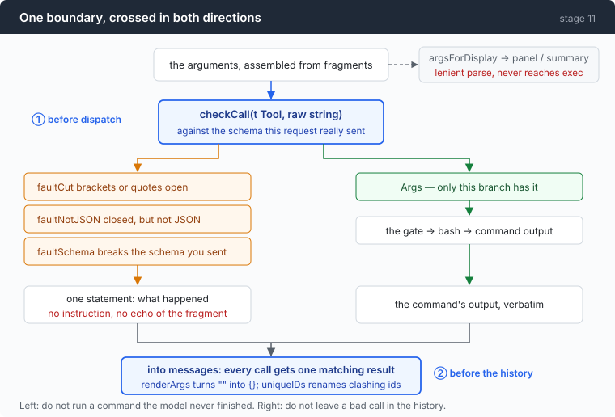
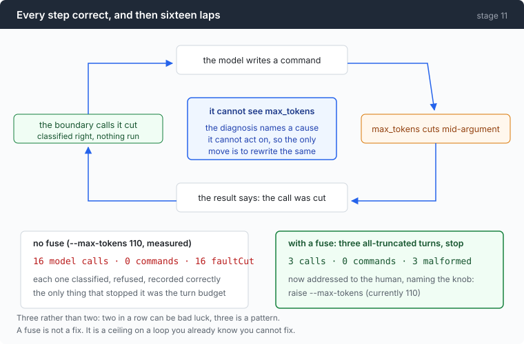
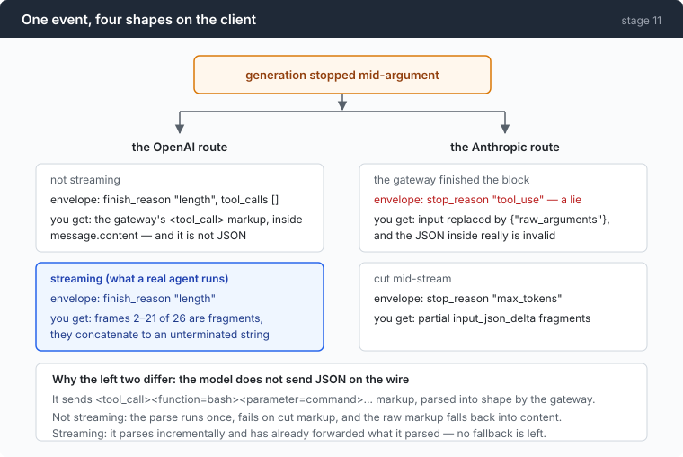

# Stage 11: Malformed — the arguments the model handed you are not valid JSON

[10](../../10-deadlock/doc/README.md) → `11` → [12](../../12-echo/doc/README.md)

> The boundary was finished, tested, and correct. On the live route at
> `--max-tokens 110` it produced **16 model calls · 0 commands · 16 faultCut** —
> every fault correctly classified, correctly refused, correctly reported, and
> zero work done for sixteen consecutive turns.

---

## The problem

The call succeeded. The stream completed. What arrived is this:

```json
{"command": "find /srv/app -type f -name \"*.go\" -not -path \"*/vendor/*\" -not -path \"*/testdata
```

An unterminated string. Not valid JSON, and the tempting move is right there:
add a `"` and a `}` and run it.

That instinct is the subject of [part 1](1-repair.md), and it is wrong in a
specific way that a measurement shows better than an argument.

Before that, there is a harder problem: **the same event reaches you in four
different shapes**, depending on protocol and whether you streamed. One of them
is a lie in the envelope — `stop_reason: "tool_use"`, meaning "the model wants a
tool run", over a body that was cut off mid-write.

And the schema you carefully published constrains nothing. Neither route
validates a returned tool call against it — not on the way out, not on the way
back. **If your client does not check, nothing does.**

---

## The idea

One boundary, crossed in both directions, with the schema this request actually
sent as the reference.



Two crossings, two different reasons:

| | why |
|---|---|
| before dispatch | do not run a command the model never finished writing |
| before the history | do not leave a bad call in the message array, where every later request re-sends it |

The second is not obvious and it is the one that kills sessions. On the OpenAI
route, **one unparseable tool call in the history is a permanently dead
session**: every subsequent request replays it, gets the same 400, and stage 09
correctly triages a 400 as fatal.

---

## Building it

### Step 1: assemble the fragments correctly first

Three argument-fragment dialects exist in the wild and no protocol document
names any of them: **incremental** (append), **cumulative** (each fragment is
the whole value so far), **re-send** (the last fragment repeats everything).

This endpoint is incremental. Guess wrong and you get
`{"command":"ls"}{"command":"ls"}` and the error
`invalid character '{' after top-level value` — a byte offset that says nothing
about the cause.

```go
if json.Valid([]byte(strings.TrimSpace(have))) {
	if json.Valid([]byte(strings.TrimSpace(frag))) {
		return frag
	}
	return have
}
if strings.HasPrefix(frag, have) {
	return frag
}
return have + frag
```

The test that separates the dialects without knowing which one you are on: a
tool call's arguments are **exactly one top-level JSON value**, so "the buffer
already parses" is a *terminal* state. Anything arriving after that is not a
continuation — it is either a replacement or a duplicate.

### Step 2: split "did not parse" into two different things

```go
switch c {
case '"':
	inStr = true
case '{', '[':
	depth++
case '}', ']':
	depth--
}
```

```go
return inStr || esc || depth > 0
```

A brace counter, which in most codebases is the beginning of a repair function.
Here it answers a narrower question: **who to blame.**

- Brackets or quotes still open → the model was cut off mid-write. `faultCut`.
- Everything closed, and still not JSON → the model wrote something that is not
  JSON. `faultNotJSON`.

Different causes, different messages, and only one of them is worth a fuse.

### Step 3: the gateway's own truncation shape

```go
if inner, ok := obj["raw_arguments"]; ok && !declaresProperty(t.Schema, "raw_arguments") {
	s, _ := inner.(string)
	return argCheck{Fault: faultCut, Detail: clip(s, maxDetail)}
}
```

`{"raw_arguments": "<invalid JSON>"}` is perfectly valid JSON. It is the
Anthropic gateway's way of handing you a block it could not finish parsing —
wrapped in an envelope that says `stop_reason: "tool_use"`.

Note the `!declaresProperty` guard. If your own schema happened to declare a
`raw_arguments` property, this heuristic would start misreading legitimate
calls, so it only fires when the key is one you never asked for.

**Stage 01's rule cannot save you here.** That rule was: never execute a call
from a `length`-terminated response. This response is not `length`-terminated —
the envelope claims a normal tool use, and the only evidence of truncation is
the shape of `input`.

### Step 4: the schema you published is advisory

```go
for _, name := range requiredNames(schema) {
	if _, ok := obj[name]; !ok {
		return fmt.Sprintf("the required %q field is absent", name)
	}
}
```

Every stage since 03 has been sending JSON Schema with its tools. Probes:

```
enum ["bash","sh"], asked for "powershell"
  OpenAI     arguments: {"command": "echo hi", "shell": "powershell"}     200
  Anthropic  input:     {"command": "echo hi", "shell": "sh"}             200

additionalProperties:false, asked for an extra timeout_ms
  OpenAI     arguments: {"command": "echo hi", "timeout_ms": "5000"}      200
```

A forbidden `enum` value and a property banned by `additionalProperties: false`,
both returned with **200** and a normal finish reason.

And the third probe shows validation alone cannot save you either:

```
command declared "string", asked for the array ["echo","hi"]
  Anthropic  input:     {"command": "[\"echo\",\"hi\"]"}
```

Both sides **serialised the array into the declared type**. That passes every
JSON Schema validator — `command` is a string — and is not a shell command. A
shell handed it runs a program named `[echo,hi]`.

### Step 5: what to tell the model (the answer here is not intuitive)

```go
case faultCut:
	return fmt.Sprintf("[not executed: the arguments for %s stopped mid-value, "+
		"so the call never finished being written]", t.Name)
```

A statement, with **no instruction in it**. Stage 10 shipped five imperative
strings inside tool results — `"— send valid JSON"`,
`"Retry with a shorter command."`, `"Do not retry it unchanged."` — and all five
had to be deleted.

The reason is not style. A tool result goes into the message array and stays
there. Every subsequent request replays it, so an instruction written for turn 4
is still being issued at turn 40, out of context, competing with the system
prompt.

So there is a test:

```go
imperatives := []string{
	"send ", "retry", "try again", "do not ", "don't ", "please ",
	"you should", "you must", "make sure", "instead, ", "next time",
}
```

Mechanical, because the failure mode is **helpfulness**, not carelessness. The
imperative version is the natural way to write these strings.

### Step 6: where the boundary stands

```go
def, known := toolByName(offered, c.Name)
if !known {
	texts[i] = fmt.Sprintf("[there is no tool called %q. The tools available to you are listed in this request]", c.Name)
	continue
}
checked := checkCall(def, c.Args)
if checked.Fault != faultNone {
	// ...
	texts[i] = faultText(def, checked)
	continue
}
```

`offered` is the tool list **from this request**, not a global. That matters
because of stage 07: at max depth the `task` tool is not offered, so a call to it
is genuinely unknown, and the message says so accurately.

There is a test-coverage finding here worth more than the code. **Removing
`checkCall` from `dispatch` entirely leaves every test green.** The boundary's
own tests never went through `dispatch`; the loop's tests pass because a call
with no `command` gets caught downstream by `emptyCommand`, and a test asserting
only "the call was refused" cannot tell which guard fired.

The check was thoroughly covered. Its **call site** was not covered at all.

### Step 7: the outbound side

```go
func renderArgs(args string) string {
	if strings.TrimSpace(args) == "" {
		return "{}"
	}
	return args
}
```

`arguments: ""` is a **400** on the OpenAI route while `{}` is accepted. And the
empty string is not hypothetical: the very first streamed `tool_calls` delta
arrives as `"arguments":""`, so a stream that breaks between the announcement and
the first fragment accumulates exactly that.

The Anthropic adapter had always done this, because `input` is an object and
there was no other option. This is protocol asymmetry showing up as a bug in
whichever half you wrote second.

`uniqueIDs` handles the other one: **a gateway can mint the same tool-call id for
every call it makes.** Harmless inside one turn — nothing reads the id but the
matching result — and across turns the protocol rejects the whole request, with a
message that **names a message index rather than a tool**, so it reads like a bug
in your message assembly.

### Step 8: run it for real, and then bolt on a fuse

```go
if out.calls > 0 && out.cut == out.calls {
	a.cutStreak++
} else {
	a.cutStreak = 0
}
if a.cutStreak >= maxCutStreak {
	a.bus.Error("%d turns in a row produced only truncated tool calls. The model cannot see the "+
		"output budget, so it will keep re-sending calls of the same length; raise --max-tokens "+
		"(currently %d)", a.cutStreak, a.cfg.maxTokens)
	return msgs
}
```



This is the most useful thing in the chapter, so it is worth being blunt about
it: **the boundary was right, and being right was worth nothing.**

The diagnosis named `max_tokens`. The model cannot see `max_tokens`. So the only
move available to it is to write the same command again at the same length, and
the loop is closed — every lap correctly classified, correctly refused,
correctly recorded.

The fuse is not a fix. It is a ceiling on a loop already known to be unfixable,
and the message it prints is addressed to **the human**, naming the knob.

Three rather than two, because two in a row is plausibly bad luck. And any call
that succeeds resets the count, or one stray truncation kills a healthy session.

---

## Run it

```sh
go build -o agent ./11-malformed/code
cd sandbox && set -a && . ../.env && set +a

../agent --provider ant --yolo --max-tokens 110 -p "find every go file under . and count the TODOs"
```

**What to watch for:** the fuse fires after three turns, and the error names
`--max-tokens 110`. Then raise it to 4096 and watch the same prompt work.

```sh
../agent --provider oai --yolo --max-tokens 110 --trace cut.jsonl -p "same prompt"
jq -r 'select(.kind=="tool_args_delta") | .text' cut.jsonl | tr -d '\n'
```

That last command prints the fragments concatenated. On the OpenAI route,
streamed, you get an unterminated string and no markup — which is the opposite of
what this repo's own wire notes recorded, for the reason in the Measured section.

---

## Measured



| route | envelope says | you receive |
|---|---|---|
| OpenAI, not streaming | `finish_reason: "length"`, `tool_calls: []` | the gateway's `<tool_call>` markup, in `message.content` |
| OpenAI, streaming | `finish_reason: "length"` | genuinely partial `arguments` — an unterminated string |
| Anthropic, gateway finished the block | `stop_reason: "tool_use"` — **a lie** | `input` replaced by `{"raw_arguments": "<invalid JSON>"}` |
| Anthropic, cut mid-stream | `stop_reason: "max_tokens"` | partial accumulated `input_json_delta` |

The streaming probe: same request, `max_tokens: 40`, **26 frames**, of which
frames **2–21** carry argument fragments and nothing else.

### A recorded conclusion in this repo's own notes was backwards

`wire-notes.md` §A2 says, from a real probe:

> `tool_calls[].function.arguments` is never returned truncated, because on a
> truncated tool call `tool_calls` is not populated at all.

That was measured with `"stream": false`. **Every real agent streams**, and
streamed, the same truncation gives you twenty frames of partial arguments.

The shape did not turn up under `curl`. It turned up under a running agent. A
protocol probe run in a mode you do not ship in can produce a confidently wrong
entry in your own evidence file.

### What the history accepts

Six bodies, identical but for `arguments`, replayed as a three-message history:

| `arguments` | HTTP |
|---|---|
| `{"command": "echo hi"}` | 200 |
| `""` | **400** |
| `{}` | 200 |
| `{"raw_arguments": "{\"command\": \"find"}` | 200 |
| `{"command": "find /srv/app -name ` (unterminated) | **400** |
| `I will run: echo hi` (prose) | **400** |

**The rule is exactly "parseable JSON", and nothing beyond it.** `{}` is accepted
despite `command` being required. The Anthropic route takes five of those six and
returns 200 for all five.

And the 400's own body:

```json
{"error":{"param":"","type":"server_error","message":"Error from provider (Console Go): Upstream request failed: [400] Invalid request parameters"}}
```

`server_error` for an unambiguous client mistake — the second instance of stage
09's pattern where an error body's own classification is wrong. Here the **HTTP
status is the field telling the truth.**

### The fuse, before and after

```
16 model calls · 0 commands · 16 faultCut
```

```
error: 3 turns in a row produced only truncated tool calls. The model cannot
see the output budget, so it will keep re-sending calls of the same length;
raise --max-tokens (currently 110)

3 calls · 0 commands · 3 malformed
```

Sixteen calls down to three. That same run produced **both** Anthropic
truncation shapes in one session: two partial-JSON fragments and one synthetic
`raw_arguments` object.

### And `newChild` dropped a stage's feature for the third time

Stage 08's sandbox. Then stage 10's `deadlines` — found here, fixed in one line.
A zero `deadlines` means every clock is **off**, because `guardBody` and
`waitFor` read `<= 0` as "no watchdog".

So stage 10's entire subject silently did not apply to subagents, and the one
child that hangs forever is exactly the case stage 10 exists to prevent.

Three stages, same function, same shape of bug: a struct assembled field by
field, because `go vet` forbids copying one that contains a mutex. Both defaults
are wrong in one direction.

### One more thing that does nothing

`stripHarnessMarkup` is gated on `StopMaxTokens`, and on this endpoint that gate
opens only on a truncated turn — where the *streamed* shape carries no markup at
all. So the strip, as shipped, finds nothing to strip on the route it was written
for. It is correct for the non-streaming shape, which this agent never uses.

---

## Next

Eleven chapters of making the agent survive things. The cheapest call, though, is
the one you do not make.

Four agents from stage 07 all run `cat go.mod` in the same second. The same test
suite runs three times in a session. A `ls -la` that has not changed gets run
again two turns later.

[Stage 12](../../12-echo/doc/README.md) builds a result cache for tool calls, and
audits — on traces you already have, with no API key — what it would have been
worth *before* writing it. The answer is **4 hits in 107 commands, saving 401
ms**, which is why it ships switched off.
