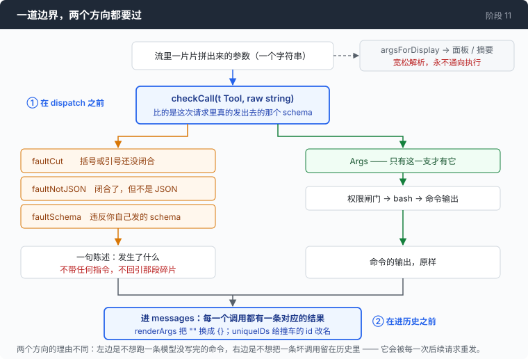
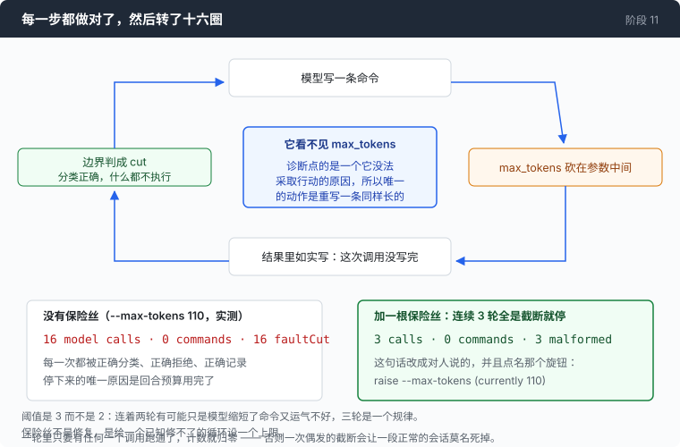
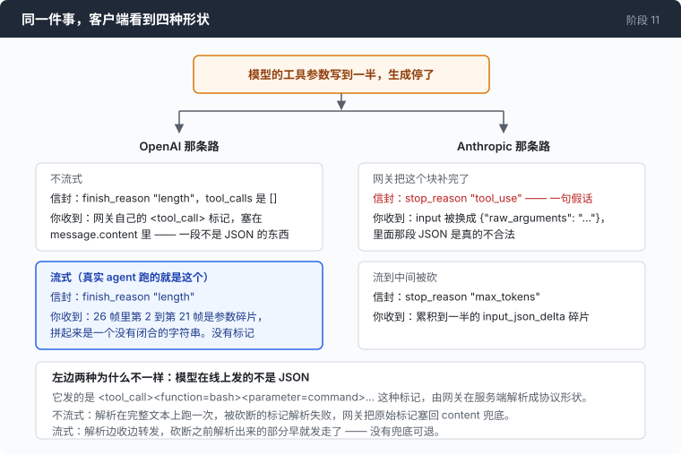

# 阶段 11：写坏的调用 —— 模型交给你的那段参数，不是合法的 JSON

[00](../../00-loop/doc/README_zh.md) → 01 → 02 → 03 → 04 → 05 → 06 → 07 → 08 → 09 → [10](../../10-deadlock/doc/README_zh.md) → `11` → [12](../../12-echo/doc/README_zh.md)

> 这一章的边界写完之后是正确的：每一次截断都被正确分类、正确拒绝、正确记录。然后它让 agent 连续十六轮什么都没干成。

---

## 问题

你让 agent 做一件需要一条长命令的事：找出某个目录下所有 `.go` 文件里带 `TODO(security)` 的行，排掉 vendor 和 testdata，排序，写到一个文件里。

模型开始写这条命令，而你屏幕上出现的是半条：`find /srv/app -type f -name "*.go" -not -path "*/vendor/*" -not -path "*/testdata` —— 后面没有了。

第 00 章的循环在这里就已经有一个分支：参数解析不出来，就把解析错误回给模型，让它自己重写。当时那是对的。

现在的问题是「解析不出来」这四个字底下不是一件事，是四件，而且责任人不同：

- 生成被输出预算砍在参数中间。模型什么都没做错，它只是没写完。
- 回来的根本不是 JSON，是一段带尖括号的标记。模型在线上发的其实就是这种标记，由网关在服务端翻译成协议形状 —— 这一次翻译失败了，于是网关把原文交给了你。
- 回来的是一段完整合法的 JSON，里面没有 `command`，取而代之的是一个叫 `raw_arguments` 的键；而信封上明明白白写着「模型要用工具」，没有任何地方说这次被砍断了。
- 回来的是完整、合法、连你自己发出去的那份声明都符合的 JSON，而那个命令字符串是 `["echo","hi"]`。一个 shell 拿到它，会去找一个叫 `[echo,hi]` 的程序。

前三种看起来都只差一点点。第一种差一个引号和一个大括号，补上，你就有一条能跑的命令了 —— 这个念头很难不产生，而且有现成的库替你干这件事。

**你手上有一段模型没写完的文字，而它下一站是 `exec.Command`。**「解析失败就回给模型」这一个分支，在这里既不够安全，也不够准确。

---

## 办法

一道边界。每一次工具调用都要过它，而且要过两次。



| 到手的是什么 | 该怪谁 | 叫什么 |
|---|---|---|
| 括号或者引号还没闭合 | 生成被砍断了，模型没写错 | `faultCut` |
| 闭合了，但根本不是 JSON | 网关的标记，或者一句人话 | `faultNotJSON` |
| 是 JSON，违反你自己发出去的声明 | 模型 | `faultSchema` |

三个值，不是一个，理由跟第 09 章有三个判决一样：它们导向不同的动作，合成一个就把动作丢了。最要紧的一对是 `faultCut` 和 `faultSchema` —— 它们对「这是谁的错」意见相反。

而这道边界**不修任何东西** —— 为什么不修，是第 [1 部分](1-repair_zh.md)整篇在量的事。它拦着两样东西：一个是 shell，一个是**消息数组**。第二样才是花钱的那样，因为一条坏调用留在历史里，会被这次会话之后的每一个请求重发。

---

## 怎么做的

代码在 [`11-malformed/code/toolcall.go`](../code/toolcall.go)。

### 第 1 步：先把碎片拼对

参数是一片一片流过来的，而且切口落在词的中间 —— `" /srv"` 和 `"/app"` 是同一个路径的两帧。最顺手的实现是无条件往后拼，它有一半的时间是错的：这个字段上有三种方言，而没有任何一份协议文档给它们起过名字。

| 方言 | 每一帧是什么 | 该怎么处理 |
|---|---|---|
| 增量 | 接下来的几个字节 | 往后拼 |
| 累积 | 到目前为止的全部 | 替换 |
| 重发 | 最后一帧是完整的全部 | 替换 |

拼错的后果是 `{"command":"ls"}{"command":"ls"}`，报的错是 `invalid character '{' after top-level value` —— 一个字节偏移量，关于原因一个字都没说。

```go
if json.Valid([]byte(strings.TrimSpace(have))) {
	if json.Valid([]byte(strings.TrimSpace(frag))) {
		return frag
	}
	return have
}
if strings.HasPrefix(frag, have) {
	return frag
}
return have + frag
```

判据是：一条工具调用的参数**恰好是一个顶层 JSON 值**。所以「手上这段已经能解析了」是一个终态，之后来的东西不可能是它的续集。这一句不需要你知道自己在哪种方言上。

### 第 2 步：「没解析成功」先分成两件事

一个只回答「这段是不是被砍断了」的扫描器，不回答别的：

```go
switch c {
case '"':
	inStr = true
case '{', '[':
	depth++
case '}', ']':
	depth--
}
```

```go
return inStr || esc || depth > 0
```

跟踪字符串状态不是多余的。`{"command":"echo {"}` 是完整的，一个不管字符串的扫描器会数到里面那个 `{`，然后把一条能跑的命令判成截断；反过来 `"find /srv` 没有任何容器，唯一的证据就是那个没闭合的引号。末尾一个孤零零的反斜杠也算 —— 一个没有东西可转义的转义符，只可能是砍在了两个字节之间。

它也不是校验器：`{]` 是闭合的、也是胡话，这里返回 false，而这是对的 —— 那是「不是 JSON」，不是「被砍断」。

这是整个仓库唯一一次用到那套数括号的机器。那套东西通常是用来**修**的，这里只用来**判断该怪谁**。

### 第 3 步：网关自己的截断形状

```go
if inner, ok := obj["raw_arguments"]; ok && !declaresProperty(t.Schema, "raw_arguments") {
	s, _ := inner.(string)
	return argCheck{Fault: faultCut, Detail: clip(s, maxDetail)}
}
```

这一支是完整合法的 JSON，所以上一步碰不到它。它是网关在一个 `tool_use` 块被砍断时合成出来的：`input` 整个被换成一个只有一个键的对象，而声明里标成必填的 `command` 干脆不在了。

要去问一句 schema 有没有声明过这个名字，而不是直接看键在不在，因为 `raw_arguments` 不是协议里的东西 —— 万一哪天真有个工具声明了一个叫这个的属性，那就是另一回事。

这里有一件必须说明白的事：**信封在这一种上是说谎的。** `stop_reason` 仍然是 `tool_use`，意思是「模型想让你跑个工具」。第 01 章那条规矩（凡是以 `length` 结尾的回复都不执行）在这里根本不会触发，因为这个回复不是以 `length` 结尾的。唯一的证据是 `input` 的形状。

### 第 4 步：你发出去的那份声明，是建议

两边的端点都不拿返回的调用去对声明检查一遍 —— 出去的时候不检，回放的时候也不检。探针拿到过一个 `enum` 明文禁止的值，也拿到过一个被 `additionalProperties: false` 禁掉的属性，两次都是 200，收尾理由正常。所以这里必须自己检：**如果客户端不检，那就没有人检。**

```go
for _, name := range requiredNames(schema) {
	if _, ok := obj[name]; !ok {
		return fmt.Sprintf("the required %q field is absent", name)
	}
}
```

必填检查排在类型检查之前，因为一条「解析成功但是空的」调用（`{}`，真的会到）是缺字段，不是字段写错，而「`command` 这个字段不在」比「其他字段都没问题」有用得多。遍历用的是排好序的键名：Go 的 map 顺序是随机的，一条每次运行点不同字段名的错误消息，是一份没人复现得出来的 bug 报告。

这个子集只覆盖这个仓库真的会发出去的那几个关键词。一个懂你从来没发过的关键词的校验器，是一个你自己写的依赖，而且它会在没人测的地方跟真货意见不一致。

两处故意的宽松，都是算过账的：声明成 `integer` 的字段收到 `5.0` 放过（`json.Unmarshal` 早就把整数和浮点都变成了 `float64`，这个区别在这一层不可观测），超出范围的值也放过；未声明的属性是**删掉**并且报一声，不是拒绝 —— 一个工具不会去读的键，删掉它不改变任何要跑的东西，而拒绝要花一整个来回：模型写、程序拒、模型读、模型再写。

顺带一句，schema 检查也救不了你。同一批探针里还有第三个，它的结果在第 [1 部分](1-repair_zh.md)。

### 第 5 步：告诉模型什么（这一步的答案不直观）

```go
case faultCut:
	return fmt.Sprintf("[not executed: the arguments for %s stopped mid-value, "+
		"so the call never finished being written]", t.Name)
```

一条规则管着这里所有的字符串：**只说发生了什么，不给任何指令。** 没有「请发合法的 JSON」，没有「换条短点的命令再试」，没有「不要原样重试」。

理由是这段文字不是一条消息，是提示词的永久增量。它进消息数组，然后这次会话之后的每一个请求都会重发它一遍。几轮之后，让它显得合理的那个上下文已经滚走了，而那句祈使句还在，于是它会被当成一条新指令读 —— 消息越老，模型执行得越理直气壮。

一句陈述句放到一百轮之后，还是一句陈述句。

第 10 章往永久性的工具结果里放了**五句**这样的话（「送合法的 JSON」「这次调用可能被砍短了，再发一次」「送一条真的 shell 命令」「换条短的重试」「不要原样重试」），全部删掉了，并且加了一条机械检查：

```go
imperatives := []string{
	"send ", "retry", "try again", "do not ", "don't ", "please ",
	"you should", "you must", "make sure", "instead, ", "next time",
}
```

一条靠关键词匹配的测试机械得有点傻。它值得的原因是：把这些句子写成建议，是最自然的写法。这里的失败模式是**好心**，不是粗心。

截断那一条还有一个决定：它不把碎片回引给模型。那是模型自己写的，它不需要被展示一遍，而那些碎片动辄几百字节的 shell 命令，回引进去就要被永远重发。

### 第 6 步：这道边界站在哪

```go
def, known := toolByName(offered, c.Name)
if !known {
	texts[i] = fmt.Sprintf("[there is no tool called %q. The tools available to you are listed in this request]", c.Name)
	continue
}
checked := checkCall(def, c.Args)
if checked.Fault != faultNone {
	// ...
	texts[i] = faultText(def, checked)
	continue
}
```

在那个按工具名分派的 `switch` **之前**，不在每个分支里面。所以每一个工具都要过它，包括以后某个从来没读过这个文件的人加的工具。

`toolByName(offered, ...)` 用的是这次请求真的在广告的那张列表，不是一张全局表。递归深度到顶的时候，`task` 工具会被整个从请求里去掉；拿全局表去校验，就会接受一次这个 agent 根本没提供过的工具调用 —— 而那正好是「没有这个工具」才是实话的那一种情况。

每一条被拒绝的调用**仍然产出一条结果**。协议要求一条助手消息里的每一个工具调用都有答案，所以在分派前面加一道闸，恰恰是最可能开始漏结果的那种改动。

还有一个让人不舒服的发现：把 `checkCall` 那一句从 `dispatch` 里整个删掉，**所有测试都是绿的**。边界自己的测试从来不走 `dispatch`；而循环的测试之所以还绿，是因为一条没有 `command` 值的调用会被下游的 `emptyCommand` 拦住，而一条只断言「这次调用被拒绝了」的测试分不出是哪道闸拦的。检查被测得很透，它的调用点一点都没被测。于是多了一个 `wiring_test.go`：喂一个照剧本回话的 provider，跑真的 `runTurn`，断言事件序列。

### 第 7 步：出去的那一侧

```go
func renderArgs(args string) string {
	if strings.TrimSpace(args) == "" {
		return "{}"
	}
	return args
}
```

一次零参数的调用要渲染成 `{}`，不能是 `""`。探针量过：`arguments: ""` 在其中一条路上是 **HTTP 400**，而 400 是致命的，于是历史里一次零参数调用就能结束整个会话。这不是假设 —— 流式的第一帧宣告工具调用时带的就是 `"arguments":""`，一个断在第一帧和第二帧之间的流，累积出来的正好是空字符串。

其余的字节原样透过。重新序列化一遍会打断第 04 章那个按字节算的缓存，因为 Go 的 map 遍历顺序是随机的。

同一个位置还有一件事：一个网关可以给它做的每一次调用都发**同一个** id。在一个回合里无害（除了配对的结果，没人读那个 id），跨回合就是协议拒收整个请求，而且拒收信息点的是消息下标而不是工具名 —— 读起来像你自己拼消息拼错了。所以 id 去重的集合是按**会话**存的，而且改名要在结果块生成**之前**做，否则你只是把「重复 id」换成了「孤儿结果」。

### 第 8 步：跑一遍真的，然后被迫加一根保险丝

边界写完了，测试齐了，行为正确。拿真的端点跑一次，把输出预算压到 110，好让每一次调用都被砍断。结果是 16 次模型调用、0 条命令，完整的数字在下面「量一量」里。



所以最后一段代码不在 `toolcall.go` 里，在循环里：

```go
if out.calls > 0 && out.cut == out.calls {
	a.cutStreak++
} else {
	a.cutStreak = 0
}
if a.cutStreak >= maxCutStreak {
	a.bus.Error("%d turns in a row produced only truncated tool calls. The model cannot see the "+
		"output budget, so it will keep re-sending calls of the same length; raise --max-tokens "+
		"(currently %d)", a.cutStreak, a.cfg.maxTokens)
	return msgs
}
```

一轮里**每一个**调用都被砍断，计数加一；只要有任何一个跑通了，计数归零 —— 否则一次偶发的截断会让一段正常的会话莫名死掉。阈值是 3 而不是 2，因为连着两轮有可能只是模型缩短了命令又运气不好，三轮是一个规律。

这不是修复，是一根保险丝，跟 `maxTurns`、`maxDepth` 是一家的：给一个已知修不了的循环设一个上限。而这句话是对**人**说的，因为那个能改的旋钮在人手里。

---

## 跑一下

先离线跑一遍这一章的判断：

```sh
go test ./11-malformed/code -run 'JSONIsOpen|CheckCall|Merge|Fault|CutStreak|Dispatch|RenderArgs|UniqueIDs' -v
```

然后真的把它逼出来：

```sh
go build -o agent ./11-malformed/code

mkdir -p sandbox && cd sandbox
set -a && . ../.env && set +a
../agent --max-tokens 110 --yolo --trace cut.jsonl
```

问一句需要长命令的话，比如 `找出这个目录下所有 .go 文件里带 TODO 的行，排序后写到 audit.txt`。

**观察重点：**

- 屏幕上一行行的 `[malformed call: cut]`，而那个 `$` 开头的命令行**一次都不出现**。没有任何东西跑起来，也没有任何东西被问「要不要执行」—— 被拒绝的调用连权限闸门都到不了。
- 三轮之后循环自己停下，错误里点名 `--max-tokens` 和它现在的值。把它改成 4096 再问同一句，那条命令一次就过。
- 会话结尾那行会变成 `3 calls · 0 commands · 3 malformed`。这个数字只在非零时打印。
- `jq -r 'select(.kind=="tool_call_invalid") | .fault' cut.jsonl | sort | uniq -c` —— 三种 fault 各几次。下面「量一量」里那次实测的会话，同时出现了截断的两种形状。

---

## 量一量

**同一件事，四种形状。** 一次工具调用在参数中间被砍断，客户端看到的东西取决于走哪条路、有没有开流：

| 路线 | 信封说 | 你收到 |
|---|---|---|
| OpenAI，不流式 | `finish_reason: "length"`，`tool_calls: []` | 网关自己的 `<tool_call><function=bash>` 标记，在 `message.content` 里 |
| OpenAI，流式 | `finish_reason: "length"` | 真的半截 `arguments` —— 一个没闭合的字符串 |
| Anthropic，网关补完了块 | `stop_reason: "tool_use"` —— 假的 | `input` 被换成 `{"raw_arguments": "<不合法的 JSON>"}` |
| Anthropic，流到中间被砍 | `stop_reason: "max_tokens"` | 累积到一半的 `input_json_delta` 碎片 |



第二行那次探测：同一个请求，`max_tokens: 40`，开流，**26 帧**，其中**第 2 到第 21 帧**只带参数碎片。拼起来正好是这个：

```
{"command": "find /srv/app -type f -name \"*.go\" -not -path \"*/vendor/*\" -not -path \"*/testdata
```

没闭合的字符串，不合法的 JSON，全程没有任何标记。

而这份证据文件里原来记着一条相反的结论：「`arguments` 永远不会被截断地返回，因为一次被砍断的调用根本不会填 `tool_calls`」。那条结论是拿 `"stream": false` 探出来的，而真实 agent 全都开流。**一次在你不发布的模式下做的协议探测，能在你自己的笔记里留下一条自信的错误结论。**

**这道边界是对的，然后 agent 什么都没做成。** 真实端点，`--max-tokens 110`：

```
16 model calls · 0 commands · 16 faultCut
```

十六次调用，每一次都被砍断，每一次都被正确分类、正确拒绝、正确记录，**连续十六轮零产出**，而停下来的唯一原因是回合预算用完了。

「把 fault 的类别判对」这件事在这里一分钱都不值。因为那个诊断点的是一个模型**看不见也动不了**的原因：它不知道 `max_tokens` 是多少，所以「你被砍断了」对它来说唯一可能的回应，就是把同样长的命令换个说法再写一遍。它不是在犯倔，它没有别的动作。

装上保险丝之后，同一种情况：

```
error: 3 turns in a row produced only truncated tool calls. The model cannot
see the output budget, so it will keep re-sending calls of the same length;
raise --max-tokens (currently 110)

3 calls · 0 commands · 3 malformed
```

**16 次变成 3 次。** 那次运行还顺手证实了一件事：同一次会话里同时出现了 Anthropic 这条路上截断的两种形状 —— 两段半截 JSON 碎片，和一个合成出来的 `raw_arguments` 对象。

### 这道边界没买到的东西

- `stripHarnessMarkup` 那段清理，是挂在「这一轮被砍断了」这个条件上的。而在这条路上，被砍断的那一轮送来的流里**根本没有标记**。为它写的那条路线上，它一次也没有东西可清。
- 第 07 章有一条专门查这种漂移的测试，而漂移存在的那四个阶段里它一直是绿的：它只问「schema 要求的，解析器都要求了吗」，从来没问反过来。于是 `description` 被广告成必填，缺了的时候解析器自己填了个默认值，四章无人发现。
- 第 10 章那三个时钟没到子 agent —— `newChild` 没复制 `deadlines`，而零值意味着三个时钟全关。这是同一个函数第三次丢掉一整个阶段的功能（第 08 章的沙箱，第 10 章的期限）。这一章用一行修掉，并且补了测试。

---

## 接下来

到 bash 的每一条调用，现在都是过了这道边界的那一条。没写完的不执行，不是 JSON 的不执行，违反声明的不执行，而且四种都不进历史当成一次真的调用；模型收到的是一句陈述句，不是一条会在十轮之后被当成新指令的建议。

于是账单又回来了。你会在同一次会话里看到 `ls -la` 跑第四遍，`cat` 同一个文件跑第三遍 —— 每一遍都要为整条命令的输出付一次钱，而那些输出还留在上下文里，一个字节都没变。

[阶段 12](../../12-echo/doc/README_zh.md) 不先写缓存，先去查一件事：一个结果缓存在真实会话里到底能省下多少。查完再决定要不要写。
