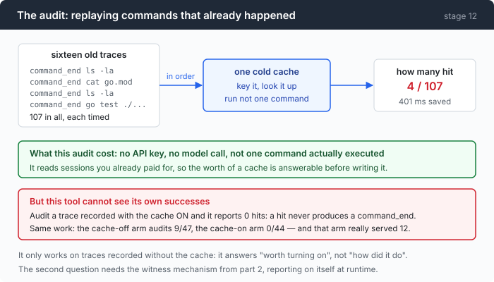

# Stage 12 · part 1: measure first, build second — auditing a cache that does not exist yet

[← back to stage 12](README.md) · next: [2 · key and witnesses](2-witness.md)

> Every trace from every earlier chapter records each command the agent ran and
> how long it took. That is enough to run a cache that never existed, over
> sessions you have already paid for, with no API key.

---

## The problem

You are about to write a result cache. Before that: **is it worth writing?**

The honest way to find out is to build it, ship it, and measure — which costs a
week and then you have a feature you may not want. The dishonest way is to
reason about it, which is what usually happens, and reasoning says obviously
yes, agents repeat themselves constantly.

There is a third option that this repository happens to have earned. Since stage
02 every session has written a trace, and every `command_end` event in it carries
the command, the byte count, the exit code and the duration.

A cache is a function from a command to a hit or a miss. You have all the
commands.

---

## The idea

Replay the recorded commands through a cold cache that executes nothing.



Only the lookup runs. There is no process, no disk read of the command's own
doing, no model call, no key. What comes out is the hit count the cache would
have achieved on work that already happened.

---

## Building it

### Step 1: check the trace actually has what you need

```go
Command  string `json:"command,omitempty"`
// ...
ExitCode  int  `json:"exit_code,omitempty"`
TimedOut  bool `json:"timed_out,omitempty"`
Truncated bool `json:"truncated,omitempty"`
Bytes     int  `json:"bytes,omitempty"`
// ...
Millis int64 `json:"ms,omitempty"`
```

Every field the audit needs was already there, put on the event in stage 02 for
a different reason. Nothing was added to the trace format for this.

That is the return on stage 02's decision to record the whole event rather than
a formatted line. A log entry saying `$ cat go.mod — 92ms` cannot be replayed;
an event can.

### Step 2: one cold cache per trace, with no limits

```go
rc := newResultCache(1<<20, 1<<30, 0)
```

A million entries, a gigabyte, no TTL. Deliberately unbounded, because the
question is "how much repetition is there in this work", not "how well does my
eviction policy perform". Adding limits would answer both at once and let you
attribute a bad result to the wrong cause.

### Step 3: only `command_end`

```go
for _, e := range events {
    if e.Kind != KindCommandEnd {
        continue
    }
    n++
    look := rc.lookup("audit", wd, e.Command, 8000, nil)
    if look.verdict == cacheHit {
        continue
    }
```

`command_end` and not `command_start`, because a command that never returned has
no result to cache. And `continue` on a hit — nothing else happens, which is the
point of the whole exercise.

### Step 4: the output is not in the trace, so pad it

```go
rc.store(look, e.Command, strings.Repeat("x", e.Bytes),
    execResult{ExitCode: e.ExitCode, TimedOut: e.TimedOut,
        Duration: time.Duration(e.Millis) * time.Millisecond})
```

The trace records how many bytes a command produced, not what they were. So the
audit stores that many `x`s.

Which is fine for what is being measured — hit counts and byte counts are
correct — and it is worth being explicit that the audit is not checking that the
cached text would have been *right*. That is part 2's job.

### Step 5: keep the refusals as a table

```go
reasons := map[string]int{}
// ...
if look.verdict == cacheRefused {
    reasons[look.reason]++
}
```

A refusal is not a failure, it is a to-do list. Every entry says "your
eligibility rule did not understand this command", and the counts tell you which
rule to relax first — or, more often, that relaxing it would buy almost nothing.

### Step 6: make it run on a machine with nothing configured

```go
if *cacheAudit_ {
    wd, _ := os.Getwd()
    if err := cacheAudit(flag.Args(), wd, os.Stdout); err != nil {
        tui.Die(err)
    }
    return
}
```

The branch is before provider resolution, which is the bug stage 06 found in
`--replay` and this is the same shape avoided. A tool whose whole selling point
is "no API key required" must not exit 1 on a machine with no API key.

---

## Run it

```sh
go build -o agent ./12-echo/code
./agent --cache-audit .work/traces/*.jsonl
```

That needs traces. If you have been running the earlier chapters with `--trace`,
point it at those; otherwise generate a few first and audit them afterwards —
which is itself the recommended order.

```sh
cd sandbox
../agent --yolo --trace t1.jsonl -p "read every .go file here and summarise the design"
../agent --yolo --trace t2.jsonl -p "count the TODOs in this repo by file"
cd .. && ./agent --cache-audit sandbox/t*.jsonl
```

**What to watch for:**

- The `refus` column, and the reasons printed under the table. Those are the
  commands your rule did not understand, and the count next to each is what
  supporting it would buy.
- The `saved` column against the wall clock of the sessions those traces came
  from. That ratio is the finding.

---

## Measured

Sixteen recorded sessions, 107 commands:

```text
trace                      cmds    hit   miss  stale  refus      saved
esc.jsonl                     1      0      0      0      1         0s
m-delegate.jsonl              4      0      3      0      1         0s
m-inline.jsonl                4      0      3      0      1         0s
mem1.jsonl                    3      0      2      0      1         0s
p-strict.jsonl               23      0     21      0      2         0s
s05-compact.jsonl            17      2     15      0      0      217ms
s05-nocompact.jsonl           6      0      6      0      0         0s
x-tight.jsonl                11      1     10      0      0       88ms
x-tight2.jsonl               11      1     10      0      0       96ms
TOTAL                       107      4     94      0      9      401ms
```

**4 hits in 107 commands. 401 ms.**

### Where the four came from

```text
turn   2   sed -n '1,150p' wire-notes.md
turn   4   sed -n '151,300p' wire-notes.md
turn   6   sed -n '301,450p' wire-notes.md
           << compacted >>
turns  7-10  four more reads, none of them a repeat
turn  11   sed -n '601,731p' wire-notes.md
           << compacted >>
turn  12   sed -n '1,150p' wire-notes.md        <- repeat of turn 2
turn  13   sed -n '151,300p' wire-notes.md      <- repeat of turn 4
```

Two repeats caused by compaction, two by a second user message. **None of them
random.** Every repeat in 107 commands has an identifiable structural cause,
which is a much more useful finding than the hit rate — it says a result cache
is not absorbing noise, it is absorbing two specific mechanisms.

### What 401 ms should be compared against

Same sixteen traces:

| | |
|---|---|
| total command time | 10,041 ms |
| total model time | **864,374 ms** |

Commands are 1.2% of the two combined. 401 ms of 864 s is **0.05%**.

And a hit returns the same bytes, so 5,447 B enter the transcript either way:
**a result cache is a wall-clock feature, not a token feature.**

### The nine refusals

```text
refused, by reason:
    4  unsupported shell character "*"
    3  unsupported shell character ">"
    2  unsupported shell character "{"
```

Four globs, three redirections, two `find … -exec … {} +`. **Not one of them is
about the program** — every refusal came from the tokenizer, before the whitelist
was consulted.

Supporting globs would buy 4 commands out of 107.

One thing the tally cannot do, and it is worth knowing: `find` is deliberately
not on the whitelist, and all three of its appearances were refused by the
tokenizer first. Two independent rules firing on one command are
indistinguishable from one, so this table cannot attribute a refusal.

### Three blind spots in this tool

**A trace records what the agent ran, not what the disk did.** If a file changed
between two identical commands, the real cache would have gone stale where the
audit scores a hit. So the number is an **upper bound**.

**It cannot see its own successes.** A cache hit emits no `command_end`, so
auditing a trace recorded with the cache *on* reports zero hits. Measured: the
same task run twice — the arm recorded without the cache audits at **9 hits in
47 commands**; the arm recorded with it, which really served **12**, audits at
**0 in 44**.

**The commands in these sessions were all readers.** Six programs across all
sixteen traces: `sed`, `wc`, `cat`, `ls`, `find`, `grep`. A whitelist of readers
covering 100% of them is an artefact of having given the agent reading tasks, not
a property of agent workloads.

---

## Next

The number is small, and the audit was cheap enough that finding out cost
nothing. [Part 2](2-witness.md) builds it anyway — because the interesting
question was never the hit rate, it is what "the same command" means and how you
know that what it read has not changed.
