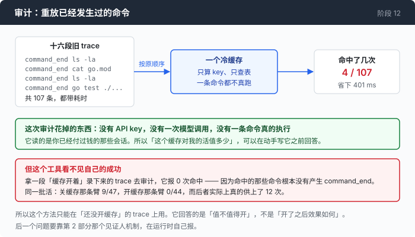

# 阶段 12 · 第 1 部分：先算，再写 —— 用已有的 trace 审计一个还不存在的缓存

[00](../../00-loop/doc/README_zh.md) → 01 → 02 → 03 → 04 → 05 → 06 → 07 → 08 → 09 → 10 → [11](../../11-malformed/doc/README_zh.md) → `12`

> [返回本章目录](README_zh.md) · 下一部分：[什么算同一条命令](2-witness_zh.md)

---

## 问题

你已经决定结果缓存是个好主意。现在的问题是：你怎么知道它是个好主意。

常规答案是写出来看命中率。这个答案有三处不对。

**它先花掉一天。** 而且不是随便一天：缓存要判断"能不能缓存这条命令"，这个判断得写一个只认它完全看懂的东西的规则集，而你现在还不知道该认哪些 —— 那些规则是被真实命令逼出来的，你手上没有真实命令的清单。

**看到的命中率是那天那个任务的命中率。** 你为了试它，会挑一个你觉得会命中的任务。这不叫测量，这叫演示。

**最要紧的是第三处：命中率是零的时候，你什么都看不出来。** 缓存返回正确答案（因为它什么都没返回，命令真的跑了），没有异常，测试全绿。README 里那条 `git log` 就是这么跑了几个月的。你想用来验证这个功能的东西，恰好是这个功能失灵时唯一不会变的东西。

而一个结果缓存的收益，其实只取决于一件事：**同一条命令，在什么都没变的情况下，被跑了几次。**

这件事已经发生过了。第 02 章开始，每一段会话都往 trace 里写了一条 `command_end`。

---

## 办法

把 trace 里的命令，按原来的顺序，重放进一个冷缓存。



能这么干，是因为 key 只由命令原文（和几个当时不变的量）决定，**和命令的输出无关**。而命令原文在 trace 里，逐字节都在。

| 一个缓存的判断需要 | trace 里有吗 |
|---|---|
| 命令原文、先后顺序 | 有，逐字节 |
| 这条命令花了多久、输出多少字节、退出码 | 有 |
| 输出的内容本身 | **没有**，只有长度 —— 而 key 用不到它 |
| 命令执行期间磁盘上发生了什么 | **没有**。这是这个办法唯一真正的窟窿，下面 量一量 里说 |

不需要 API key，不需要模型，一条命令都不会被执行。花的时间是几十毫秒。

---

## 怎么做的

审计工具是 [`echo.go`](../code/echo.go) 里的 `cacheAudit`，一个函数。

### 第 1 步：确认 trace 里真的有需要的东西

`Event` 结构体（[`events.go`](../code/events.go)）里，一条 `command_end` 带着这些字段：

```go
Command  string `json:"command,omitempty"`
// ...
ExitCode  int  `json:"exit_code,omitempty"`
TimedOut  bool `json:"timed_out,omitempty"`
Truncated bool `json:"truncated,omitempty"`
Bytes     int  `json:"bytes,omitempty"`
// ...
Millis int64 `json:"ms,omitempty"`
```

这不是为这一章加的。第 02 章写这些字段，是为了在屏幕上把每条命令的耗时和输出大小显示出来；第 06 章用它们做回放。一份为了别的目的记全了的记录，现在能回答一个当时还没被提出的问题 —— 这是 trace 这个东西最值钱的地方，也是**记录原始事实而不是记录结论**的回报。

### 第 2 步：一条 trace 一个冷缓存，而且不设上限

```go
rc := newResultCache(1<<20, 1<<30, 0)
```

三个参数都是故意开到没有意义的大：一百万条、一 GB、过期时间 0（永不过期）。审计要回答的是"这些命令里有多少重复"，不是"256 条的容量够不够"。把容量掺进来，你会得不到一个能解释的数字 —— 命中率低到底是因为没有重复，还是因为被挤掉了。

一条 trace 一个新缓存，也是同一个道理：两段会话之间不该有命中，它们跑在不同的时间、不同的目录，甚至不同的机器上。跨 trace 的命中是虚的。

### 第 3 步：只看 `command_end`

```go
for _, e := range events {
    if e.Kind != KindCommandEnd {
        continue
    }
    n++
    look := rc.lookup("audit", wd, e.Command, 8000, nil)
    if look.verdict == cacheHit {
        continue
    }
```

`command_end` 而不是 `command_start`：审计需要耗时和字节数，那两个数字只有命令结束之后才知道。

命中就 `continue` —— 因为在真实的会话里，命中意味着命令**不会跑**，所以也不该有第二次存储。这一行让重放和真实执行对齐。

顺手记住这一行 `if e.Kind != KindCommandEnd`。下面 量一量 里那个最难看的发现就是从它长出来的。

### 第 4 步：输出的内容不在 trace 里，用等长的填充顶上

```go
rc.store(look, e.Command, strings.Repeat("x", e.Bytes),
    execResult{ExitCode: e.ExitCode, TimedOut: e.TimedOut,
        Duration: time.Duration(e.Millis) * time.Millisecond})
```

trace 记了输出有多少字节，没记内容（那会让每份 trace 大出一个数量级）。所以这里存进去的是 `e.Bytes` 个 `x`。

这件事听起来像在造假，但它对两个要算的数都没有影响：命中与否只看 key，key 只看命令；"省下多少字节"只看长度，长度是真的。而存进去的耗时是那条命令**当天真的花掉的时间** —— 这也是唯一诚实的算法。有人会去测"查一次缓存花了多久"然后把差值叫做节省，那个数什么都不是：没跑的那条命令没有耗时可以被减掉。

### 第 5 步：把拒绝的理由记成一张表

```go
reasons := map[string]int{}
// ...
if look.verdict == cacheRefused {
    reasons[look.reason]++
}
```

命中率是一个判决，**拒绝理由是一张待办清单**。它指名道姓地说出哪条规则挡住了什么，于是你能算出把那条规则放宽能换来几条命令 —— 而这是一个可以在写代码之前算出来的数。

这一步只有五行，是这个工具里最有用的五行。下面 量一量 那节最后一段的规则改动，整个是这张表点出来的。

### 第 6 步：让它在什么都没配置的机器上也能跑

```go
if *cacheAudit_ {
    wd, _ := os.Getwd()
    if err := cacheAudit(flag.Args(), wd, os.Stdout); err != nil {
        tui.Die(err)
    }
    return
}
```

这个分支放在 `main()` 里所有供应商初始化**之前**，和第 06 章的 `--composer-dump` 一样。理由写在 `main.go` 的注释里：这个工具存在的意义是让你在决定要不要开缓存之前先看一眼，而这个决定应该能在一台没有 key 的笔记本上做出来。

一个必须先配好线上端点才能运行的成本分析工具，多数时候不会被运行。

---

## 跑一下

```sh
go build -o agent ./12-echo/code

./agent --cache-audit sandbox/s05/*.jsonl sandbox/s10/*.jsonl
```

参数是任意多个 trace 文件。前面每一章跑出来的 trace 都能直接喂进去 —— 第 05 章的压缩实验、第 07 章的分身实验、第 09 章的分诊实验，那些文件现在都是这一章的输入。

新造一份也很便宜，随便跑一段会话加上 `--trace t.jsonl` 就有了。

**观察重点：**

- 每一行末尾的 `saved` 列。大多数会话这一列是 `0s`。
- `refus` 那一列和最后那张 `refused, by reason` 表。多数会话里 refused 比 hit 多一个数量级，而理由通常只有三四种 —— 那是一份很短的、可以逐条评估的清单。
- `hit` 和 `miss` 的比例随会话性质变化很大。逐段读一个大文件的会话有可能命中；跑测试、跑构建的会话一次都不会。

想核对下面这些数字，把这个仓库能找到的 trace 全喂进去：

```sh
./agent --cache-audit $(find sandbox -name '*.jsonl' | sort)
```

---

## 量一量

十六段真实会话，107 条命令。这是完整输出：

```text
trace                      cmds    hit   miss  stale  refus      saved
esc.jsonl                     1      0      0      0      1         0s
m-delegate.jsonl              4      0      3      0      1         0s
m-inline.jsonl                4      0      3      0      1         0s
mem1.jsonl                    3      0      2      0      1         0s
mem2.jsonl                    0      0      0      0      0         0s
p-pipe.jsonl                  1      0      0      0      1         0s
p-steps.jsonl                 1      0      0      0      1         0s
p-strict.jsonl               23      0     21      0      2         0s
s05-compact.jsonl            17      2     15      0      0      217ms
s05-nocompact.jsonl           6      0      6      0      0         0s
s05-roomy.jsonl               6      0      6      0      0         0s
sb.jsonl                      3      0      2      0      1         0s
x-none.jsonl                  8      0      8      0      0         0s
x-roomy.jsonl                 8      0      8      0      0         0s
x-tight.jsonl                11      1     10      0      0       88ms
x-tight2.jsonl               11      1     10      0      0       96ms
TOTAL                       107      4     94      0      9      401ms

hit rate 3.7% of 107 commands · 21.0kB of output not re-read · 401ms of command
time not re-run
```

十六段会话里有十三段一次都没命中。四次命中来自三段会话，一共省下 401 毫秒。

### 那四次是怎么来的

命中不是随机分布的噪声，四次全都有明确来源。`s05-compact.jsonl` 那两次是这样的：

```text
turn   2   sed -n '1,150p' wire-notes.md
turn   4   sed -n '151,300p' wire-notes.md
turn   6   sed -n '301,450p' wire-notes.md
           << compacted >>
turns  7-10  four more reads, none of them a repeat
turn  11   sed -n '601,731p' wire-notes.md
           << compacted >>
turn  12   sed -n '1,150p' wire-notes.md        <- repeat of turn 2
turn  13   sed -n '151,300p' wire-notes.md      <- repeat of turn 4
```

两次重复紧跟在一次压缩之后。另外两次（`x-tight`、`x-tight2`）跟在一条新的用户消息之后。

**四次，两个来源，没有一次是随机的。** 这句话说的是：模型不是在犯冗余的错，它是在**找回自己丢掉的东西**。压缩把前面读过的内容换成了一段摘要，新的用户消息把注意力拉回了前面的话题 —— 两种情况下那些字节都已经不在它眼前了。

这个结论顺手关掉了一条路。既然重复的原因是"先前的结果已经不在上下文里"，那么命中时就**不能**用一句"你在第 2 轮跑过这条命令"来回答 —— 那句话指向的东西正是不存在的那个东西。缓存必须把原原本本的 5,447 字节再交回去一遍。

于是这个功能的性质就定了：一次命中，进上下文的字节数和不命中时**完全一样**。

**结果缓存是一个省时间的功能，不是一个省 token 的功能。** 这一点会在第 3 部分再被撞一次。

### 401 毫秒该跟什么比

同样这十六段 trace，把另外几个数也算出来：

| | |
|---|---|
| 命令条数 | 107 |
| 命令总耗时 | 10,041 ms |
| 命令耗时中位数 | 92 ms |
| 最慢的一条命令 | 182 ms |
| 命令输出写进上下文的总字节 | 401,783 B |
| 模型调用次数 | 173 |
| 模型总耗时 | 864,374 ms |

十秒的 shell，十四分钟的模型。两者加起来，**命令占 1.2%**。

一个能消灭每一条命令的完美缓存，让这些会话快 1.2%。而实际能拿到的是这 1.2% 里的 3.7%，也就是 **0.04%**。

中位数 92 毫秒那一行也值得单独看一眼：这就是缓存每次命中真正省下的东西。一条命令的中位耗时是 92 毫秒，最慢的一条是 182 毫秒 —— 这里没有那种"跑一次要八秒"的命令，因为一个只有 bash 的 agent 干的事大多是读文件。

### 拒绝的九条，和它们指向的规则

```text
refused, by reason:
    4  unsupported shell character "*"
    3  unsupported shell character ">"
    2  unsupported shell character "{"
```

九条拒绝，**没有一条是因为程序不在白名单上**：四条是通配符，三条是重定向（两个 `2>&1`，一个 `2>/dev/null`），两条是 `find … -exec … {} +`。

这张表能直接换算：支持通配符能多缓存 **107 条里的 4 条**。而支持通配符要求分词器知道 shell 会把 `*.md` 展开成哪些文件，还要求那个展开结果本身成为一个见证人 —— 目录里多出一个文件，答案就变了，而没有任何一个已记录的见证人会因此改变。四条命令换这些，答案是不做。

`find` 出现过三次，一次都没走到"程序在不在白名单上"那一步 —— 三次都先被分词器以 `{` 或 `*` 挡下了。这里有一处这张表自己的毛病：**它没法归因。** 一条命令同时违反两条规则，和只违反一条，在这张表里长得一模一样。

同一个工具在另一段 trace 上给出的一条，是被真的照做了的：三条 `grep` 拒绝，理由分别是 `unknown flag -oE`、`-oP`、`-noiE`。三条理由指的是**同一件事** —— 模型会把短选项捆在一起写。这不是三次意外，是一个类别。于是白名单里加了 8 行：允许捆写，但仅当捆里每一个字母都是这条规则已经列出的布尔选项，所以 `grep -oP` 还是会因为 `-P` 被拒。

一条待办清单和一个判决的区别就在这里：判决只告诉你划不划得来，清单告诉你**改哪一行**。

### 这个工具的三处盲区

**一，命中数是上限。** trace 记的是 agent 跑了什么，不是磁盘上发生了什么。重放的时候没有任何文件在变，所以每一次重复都算命中；真实会话里那个文件可能已经被改过，那次就该是 stale。真实数字只会比 3.7% 更低。

**二，样本是被派去读东西的会话。** 十六段会话里出现过的命令程序一共**六个** —— `sed`、`wc`、`cat`、`ls`、`find`、`grep`，五个在白名单上。一个只认读命令的白名单能覆盖它们几乎全部，这是**样本的性质**。换一批以构建、测试、git 操作为主的会话，覆盖率会掉下来，命中率也会。

**三，这个工具看不见自己的成功。** 这一条最难看，而且是量出来的。

回头看第 3 步那一行 `if e.Kind != KindCommandEnd`。审计只数 `command_end`。而一次真实的缓存命中**不发** `command_end` —— 没有进程启动，也没有进程结束，凭什么发。

于是：**用一份开着缓存跑出来的 trace 去做审计，报出来的命中数是 0。**

同一个任务的两次运行，一次关缓存一次开缓存：

| | 命令条数 | 审计报出的命中 | 缓存自己数到的命中 |
|---|---:|---:|---:|
| 关着缓存录的 | 47 | **9** | —— |
| 开着缓存录的 | 44 | **0** | **12** |

第二行那个 0 完全不代表缓存没工作 —— 它当场服务了 12 次。只是那 12 次在 trace 里的痕迹是 12 条 `result_cache`，不是 `command_end`。

这不是一个 bug，修它反而是错的：一次命中里没有进程，trace 就不该说有。第 3 部分会把这个决定完整摊开。这里要记住的是**用法上的规矩**：

> 审计要拿**关着缓存**跑出来的 trace 做。开着缓存的 trace 已经不是审计的输入了 —— 它自己就带着答案，那个答案叫 `result cache: 12 hits`。

一个用来评估某功能的工具，对该功能生效过的任何会话都是瞎的。你会更愿意这句话不成立，但它成立，而且写下来的成本比读者自己撞上去的成本低得多。

---

## 接下来

审计给出 3.7%、401 毫秒、万分之四。按理说这一章该在这里结束。

它没有结束，有两个理由，而且两个理由都不是"沉没成本"。

第一，3.7% 是十六段**单 agent** 会话的平均值。里面有一段的形状明显不同 —— 四个 agent 同时读同一个文件的时候，重复不是隔了四十轮出现的，是隔了几毫秒。那是这个缓存唯一可能有意义的场景，而它到底有多少意义，得真造出来才能量。

第二，也是更重要的：**"这条命令能不能被缓存"这个判断，本身就是这一章要教的东西。** 它逼你回答两个问题，而这两个问题在一个 agent 里到处都是 ——

**什么算同一条命令？** 命令原文相同就够了吗？环境变量呢？工作目录呢？输出被截断的长度呢？

**怎么知道它读过的东西没变？** 看修改时间就行吗？

第二个问题的答案是"不行"，而且理由是量出来的：这台机器上 2000 次等长改写里，有 1498 次 `(size, mtime)` 看不出区别。

[第 2 部分](2-witness_zh.md) 是这两个问题，和那个在 Windows 上白过了四个月的断言。
