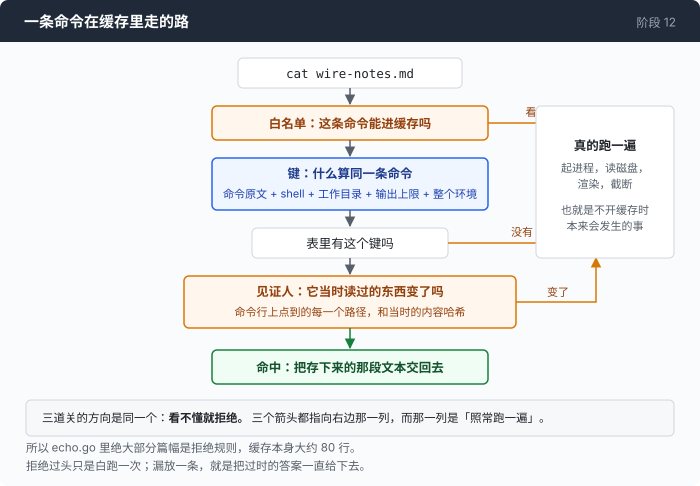

# 阶段 12 · 第 2 部分：什么算同一条命令，它读的东西变了没有 —— 键、白名单、见证人

[00](../../00-loop/doc/README_zh.md) → 01 → 02 → 03 → 04 → 05 → 06 → 07 → 08 → 09 → 10 → [11](../../11-malformed/doc/README_zh.md) → `12`

> [返回本章目录](README_zh.md) · 上一部分：[先算，再写](1-audit_zh.md) · 下一部分：[接进循环，然后把它默认关掉](3-off_zh.md)

---

## 问题

审计给出的数字是 401 毫秒。第 1 部分末尾说了为什么还要往下写，那就从头写 —— 而第一步要回答一个听起来不值得回答的问题：**两条命令什么时候算同一条命令。**

第一个答案是"字符串一样就算"。拿命令原文当键，`cat notes.md` 存一次，下次原样给回去。然后你会一件一件地想起来：

- 同一条 `cat notes.md`，一次在 `/a` 里跑，一次在 `/b` 里跑。
- 同一条命令，输出上限从 8000 改成 4000。被截断的位置不一样了，而进上下文的是截断之后那些字节。
- 同一条 `sed -n '1,150p' notes.md`，两次之间有人改了 `notes.md`。
- 同一条 `cat notes.md > out.txt`。它不是在读文件，它在写文件 —— 把它的输出存下来下次直接给回去，那次写就没有发生过。

前三条是键的问题，第四条不是：那条命令根本就不该进缓存。于是要回答的是两个问题 —— **什么算同一条命令**，和**它读过的东西变了没有**。

两个都长得像十分钟能写完的样子。第一个的麻烦在于"能改变答案的东西"这张清单比你想的长；第二个的麻烦在于最自然的那个办法是错的，而且它错的时候不会告诉你。

---

## 办法

三样东西，各管一件事。

| 东西 | 回答什么 | 它错了会怎样 |
|---|---|---|
| 键 | 两条命令是不是同一条 | 少放一样进去，就会把 A 目录的答案交给 B 目录 |
| 白名单 | 这条命令能不能进缓存 | 放宽一条，一次写盘会被当成答案存起来 |
| 见证人 | 它读的东西变了没有 | 看不出变化，就会把过时的答案一直给下去 |



三样东西的方向是同一个：**看不懂就拒绝。** 第 08 章从安全那一侧得到过同一个结论 —— 你没法靠读一条 shell 命令的字面断定它会干什么。区别只在两边允许往哪边错：一个漏掉了危险写法的黑名单，会真的把那条命令执行掉；一个拒绝过头的白名单，只是让这条命令照常跑一遍，而那本来就是不开缓存时会发生的事。所以 [`echo.go`](../code/echo.go) 里绝大部分篇幅是拒绝规则，缓存本身大约 80 行。

---

## 怎么做的

### 第 1 步：键里放上四个"现在不会变"的量

```go
func keyOf(shell, wd, command string, maxOutput int, env []string) string {
	sorted := append([]string(nil), env...)
	sort.Strings(sorted)
	h := sha256.New()
	fmt.Fprintf(h, "v1\x00%s\x00%s\x00%d\x00", shell, wd, maxOutput)
	for _, e := range sorted {
		fmt.Fprintf(h, "%s\x00", e)
	}
	fmt.Fprintf(h, "\x00%s", command)
	return hex.EncodeToString(h.Sum(nil))
}
```

shell、工作目录、输出上限、整个环境。这四样在这个进程活着的时候一个都不会变，把不会变的东西放进键里看起来像迷信 —— 它是给下一个功能买的保险。哪天有人把这个缓存落到磁盘上，或者给子 agent 单独开一个工作目录，这四样里就有几样不再是常量，而一个只是碰巧正确的键，会开始把一个目录的答案交给另一个目录。那种错误没有报错，也没有异常。

输出上限在里面，是因为存的是**已经渲染、已经截断**的那段文本，也就是模型真正读到的字节。同一条命令换一个上限，产生的就是另一批字节。

`sort.Strings(sorted)` 不是为了好看。`os.Environ()` 不承诺顺序，一个不排序的环境哈希，会在两个毫不相干的变量交换位置时给出不同的键 —— 测试里有一条专门拿 `{"A=1","B=2"}` 和 `{"B=2","A=1"}` 比键，断言的话说得很直接：`the key depends on the order os.Environ() happened to return`。

刻意不放进键的是：时间、轮次、发起这条命令的是哪个 agent。这三样要是也算进去，就没有任何一条记录能被重用了。

### 第 2 步：分词器只认四样东西，其余一律是错误

判断能不能缓存之前得先把命令切成参数。`splitPipeline` 认单引号、双引号、反斜杠转义，和一个竖线。别的全是错误：

```go
case '$', '`', ';', '&', '<', '>', '(', ')', '{', '}', '\n', '\r', '#', '*', '?', '[', ']', '~', '!':
	return nil, fmt.Errorf("unsupported shell character %q", string(c))
```

这一行把所有能重定向输出、能起第二条命令、能替换命令输出、能展开变量、能开子 shell 的写法一次挡掉。表看起来短，是因为被接受的那部分语法很小。它不是一个 shell，也不该长成一个 shell —— 哪天它真的需要看懂 `$(...)` 才有用，正确的做法是接第 08 章那个真正的解析器。

通配符和控制符写在同一行，理由是相近的：`cat *.md` 点到的是一组由 **shell** 决定的文件，所以这个函数报出来的路径不是命令真正读的路径；目录里新出现一个文件，答案就变了，却没有任何一个记下来的见证人会因此改变。第 1 部分那张拒绝表里最大的一项就是它。

### 第 3 步：白名单的单位不是程序，是程序加选项

`sed` 读文件，`sed -i` 原地改文件。`sort` 读文件，`sort -o` 写文件。按程序名列白名单，在会进这张表的十一个程序里有两个是错的。

所以一条规则记的是这个程序允许被告知的**全部**选项：

```go
"sort": {boolFlags: set("-n", "-r", "-u", "-h", "-b", "-f", "-V", "-g"),
	valueFlags: set("-k", "-t", "-S")},
```

`-o` 是靠"没有被列出来"被拒的，不是靠被点名拒绝。这个区别会救下一个往表里加选项的人一次：漏掉一个危险选项不会造成放行，只会造成一次拒绝。`grep` 那条规则里 `-r` 和 `-R` 也是这样缺席的 —— 一个递归 `grep` 的见证人是**一整棵树**，而一张路径列表装不下一棵树，见证人集合悄悄地不完整比没有缓存更糟：它给的是自信的过时答案，而不是慢一点的正确答案。`ls -R` 不在 `ls` 的选项表里，是同一个理由。

有一处放宽是那张拒绝表点名要来的。模型会把短选项捆着写，`grep -oE` 就是 `-o` 加 `-E`；第 1 部分那张表在一段会话里报了三条 `unknown flag`：`-oE`、`-oP`、`-noiE` —— 三条理由指的是同一件事，那是一个类别，不是三次意外。八行改动，只有当捆里**每一个字母**都是这条规则已经列出的布尔选项时才放行：

```go
for _, c := range a[1:] {
	if c > 127 || !r.boolFlags["-"+string(c)] {
		return false
	}
}
```

所以 `grep -oP` 还是会因为 `-P` 被拒，一个末尾是"要取值的选项"的捆（`grep -om`）会被拒，不会被猜。

### 第 4 步：sed 的脚本是一个程序，不是一条路径

```go
func sedScriptSafe(script string) error {
	if i := strings.IndexAny(script, "wWrRe"); i >= 0 {
		return fmt.Errorf("script contains %q, which could be a file or exec command", script[i])
	}
	return nil
}
```

sed 脚本里 `w` 把模式空间写进文件，`W` 写第一行，`r` 读进一个文件，`R` 读一行，`e` 执行一条 shell 命令。这五个字母出现在脚本的任何位置，这条命令就被拒。

它看的是每一个字符，不是命令位置 —— 所以 `sed -n '/word/p'` 也被拒了，因为规则分不清 "word" 里那个 `w` 和 sed 的 `w` 命令。这个拒绝是错的，而且是故意留错的：

```go
if _, ok, _ := eligible("sed -n '/word/p' notes.md", dir); ok {
	t.Error("accepted a sed script containing 'w'. The rule is allowed to be stupid in exactly one " +
		"direction: a false refusal costs one command, a false acceptance writes to the user's disk " +
		"and then serves the write from a cache")
}
```

一次错误的拒绝，代价是一条命令 —— 按十六段真实会话量出来的中位数，92 毫秒。一次错误的接受，代价是往用户的磁盘上写了东西，然后把那次写当成答案存起来给出去。这条规则被允许犯傻，但只允许朝一个方向犯傻。测试还有一个作用：哪天有人要"修好"这个拒绝，他得先删掉一段写明了它是故意的断言。

另外，`sed -n '1,150p' notes.md` 里 `'1,150p'` 是脚本，`notes.md` 是路径，规则得知道前几个非选项参数是程序而不是文件。搞错了，那段脚本会被当成路径放进见证人集合，哈希永远是空 —— 读起来就是永久过期：一个从不命中、也从不说明原因的缓存。

### 第 5 步：见证人不能用（大小，修改时间）

这是唯一一处"最自然的办法是错的"，而且理由是量出来的。一个改写前后长度不变的文件 —— `route2:x` 改成 `route3:y` —— 在这台机器上 2000 次背靠背改写里有 **1498 次**，用（大小，修改时间）看不出任何区别。原因在下面 量一量 里。

所以见证人记的是内容哈希：

```go
b, err := os.ReadFile(path)
if err != nil {
	return ""
}
sum := sha256.Sum256(b)
return "f:" + hex.EncodeToString(sum[:])
```

路径不存在不算错误：返回空串，不返回 error。这样一个消失了的见证人，和当初它存在时记下的哈希比起来就是不相等的，也就是过期。要是这里返回 error，"文件被删了"就变成了缓存的一次故障，而它其实是关于世界的一个事实。而目录的见证人，是它**一层**列表的哈希：

```go
fmt.Fprintf(h, "%s\x00%d\x00%d\x00%d\x00", n, sub.Size(), sub.Mode(), sub.ModTime().UnixNano())
```

名字、大小、权限、修改时间。这大致就是 `ls -l` 会打印的东西，所以也大致就是一次 `ls` 的结果依赖的东西。只哈希名字会漏掉一种情况：目录里不增不减、一个文件变大了，`ls -l` 打印的数字变了而哈希没变。这一条有单独的测试盯着。

### 第 6 步：哈希两次，前后不一致就什么都不存

见证人被哈希两次：一次在查询时、命令跑之前，一次在存的时候、命令跑完之后。两次都必要，单独哪一次都不够。

```go
ws := digestAll(witnessPaths(look.before))
if len(ws) != len(look.before) {
	return
}
for i := range ws {
	if ws[i] != look.before[i] {
		return // it changed under the command; this text describes nothing
	}
}
```

只取**跑完之后**那次：一个正在被读的文件如果中途变了，读出来的是一个撕裂的结果，而这个结果会被存在"文件最后那个哈希"底下 —— 下一次查询发现见证人对得上，就把一个从来没有对应过文件任何一个状态的结果交了出去。缓存现在是自信地错着，一直错到那个文件再变一次。

只取**跑之前**那次：不会给出错的答案，但一个在查询和执行之间变过的文件，会被存在它已经不再拥有的哈希底下 —— 这条记录从生下来就是过期的，以后每次查询都会重跑命令。安全，而且悄无声息地毫无用处。比较这两次多花一次哈希，68 微秒，对着一条中位数 92 毫秒的命令。

同一个函数里还有一条更短的拒绝：

```go
if r.ExitCode != 0 || r.TimedOut || r.Cancelled || r.Unreaped {
	return
}
```

退出码是一次**遭遇**，不是一个答案。而会重复出现的遭遇，恰好是你最不希望被冻住的那些：一次权限抖动、一个正在被写的文件、一块满了一分钟的磁盘。反过来做的后果有现成的例子（这是另一个已发布 agent 里的事，这个仓库没有它的记录）：一个代码索引把**解析失败**也按内容哈希缓存了下来，于是修好解析器之后一个文件都没有被重新索引 —— 每个文件还是哈希到那段曾经失败过的字节上。

### 第 7 步：那个在 Windows 上白过了四个月的断言

双引号里的反斜杠，规则和引号外面不一样。bash 只在 `$` `` ` `` `"` `\` 和换行前面把它当转义，在别的字符前面它就是一个普通字符：

```go
case '\\':
	if i+1 >= len(command) {
		return nil, fmt.Errorf("trailing backslash")
	}
	if next := command[i+1]; next == '$' || next == '`' || next == '"' || next == '\\' || next == '\n' {
		i++
	}
	cur.WriteByte(command[i])
	continue
```

写错这一处的后果是：`cat "D:\Projects\x.md"` 会被吃掉两个反斜杠，变成 `D:Projectsx.md`。这个路径不存在，它的哈希永远是空串，无论真实的那个文件发生什么。**什么都不会失败。** 见证人只是没有在看任何东西。而这不是假想的写法 —— 一段录下来的会话里，四条命令有三条长这样，因为模型看到的工作目录是用反斜杠报给它的。

这一处有测试，而测试本身出过一次问题。原来那条断言是"这个路径哈希出来不是空的"，它绿了四个月，因为它只在 Windows 上跑过。在 Linux 上，`D:\Projects\x.md` 是一个**带反斜杠的合法文件名**，它谁也不指，哈希理应是空的。断言看起来在守卫一条通用的语法规则，守的其实是它碰巧运行的那个平台。

改法是把两件事分开。反斜杠有没有被吃掉是 shell 语法，到处都成立，所以改成数个数 —— `strings.Count(paths[0], "\\")` 和命令行里原有的个数必须相等，少一个就是被吃掉了。而那个参数接下来是否指向一个真实文件，是这台机器的属性，所以圈起来：

```go
if runtime.GOOS == "windows" {
	if d := digestOf(paths[0]); d == "" {
		t.Fatalf("the witness %q hashes to nothing, so it can never go stale", paths[0])
	}
}
```

留下来的规矩比这个 bug 有用：**一条只在一种平台上跑过的断言，说的是那个平台，不是那条规则** —— 而它绿着的那四个月里，看不出任何区别。

### 拼起来

一次查询同时回答三个问题 —— 能不能缓存、有没有存过、存的还成不成立：

```go
func (rc *resultCache) lookup(shell, wd, command string, maxOutput int, env []string) cacheLookup {
	paths, ok, why := eligible(command, wd)
	if !ok {
		return cacheLookup{verdict: cacheRefused, reason: why}
	}
	key := keyOf(shell, wd, command, maxOutput, env)
	// ...
	e, have := rc.entries[key]
	if !have {
		return cacheLookup{key: key, verdict: cacheMiss, before: digestAll(paths)}
	}
	stored := e.witnesses
	rc.mu.Unlock()

	changed := ""
	for _, w := range stored {
		if d := digestOf(w.Path); d != w.Digest {
			changed = w.Path
			break
		}
	}
	// ...
	if changed != "" {
		return cacheLookup{key: key, verdict: cacheStale, reason: changed, before: digestAll(paths)}
	}
	return cacheLookup{key: key, text: e.text, verdict: cacheHit, millis: e.millis}
}
```

哈希是在锁**外面**做的。它要碰磁盘，而在一个几个子 agent 共用的缓存里，握着互斥锁跨一次文件系统调用，是让缓存比它替代的东西更慢的标准做法。锁外面开的那个竞争是真的，也是无害的：另一个 goroutine 可能在这段时间里把这条记录挤掉，所以后面还要重查一次，而重查失败的代价是白查一次，不是一个错答案。

`before` 那个字段是给存的时候用的 —— 它带着这些见证人在命令读它们**之前**的哈希，第 6 步那次比较靠它。

---

## 跑一下

这一部分的东西全部不需要 key，也不需要网络：

```sh
go test ./12-echo/code -run 'TestEligible|TestASedScript|TestASameLength|TestABackslash|TestReportTheNatural|TestTheKey' -v
```

里面 `TestReportTheNaturalSameLengthCollisionRate` 那一行 `t.Logf` 不断言，只报数 —— 300 次改写里有多少次（大小，修改时间）看不见，是你这台机器的属性，跑一次就知道。`TestASameLengthRewriteWithTheSameMtimeIsStillCaught` 则把修改时间**强行设回原值**，而不是去赌一次竞争，断言的是那条规则而不是一个概率。

然后真的开着它跑一段：

```sh
go build -o agent ./12-echo/code

cd sandbox
set -a && . ../.env && set +a
../agent --cache --trace t12b.jsonl
```

试这两句：

1. `读一遍 wire-notes.md 的前 60 行，告诉我里面提到了哪些 HTTP 状态码`，等它读完，在另一个终端里往那个文件中间改一个词，然后 `再读一遍前 60 行，看看有没有变`
2. `用 cat *.md 把这个目录里所有 markdown 文件连起来数一下总行数`

**观察重点：**

- 第 1 句的第二次读，判决是 `stale` 而不是 `hit`。改一个词，长度都可能没变，而它照样被看见了。
- 第 2 句里那条带 `*` 的命令，判决是 `refused`，理由是 `unsupported shell character "*"`。它照样跑了，输出照样是对的 —— 拒绝的意思是"不进缓存"，不是"不执行"。每轮结尾那一行 `result cache: …` 里，`refused` 通常比 `miss` 大。

---

## 量一量

### （大小，修改时间）看不见的那些改写

```text
P2 same-length rewrite, back to back
   1498/2000 rewrites were invisible to (size, mtime)
   the bytes differ every time: "route2:x" -> "route3:y"
```

打印出来那一次是 2000 次里 1498 次，大约 **75%**。这个数不能报三位有效数字，而这句话必须跟上：同样这 2000 次连跑五遍，得到的是 **1440、1442、1449、1456、1457**，大约 72%；趁机器正忙的时候取一次，是 **1087**，54%。它跟着"这个进程被允许跑多快"一起动。

稳的那一半是：**这个数不是零，也不是个别情况** —— 而它取决于时间戳，所以不可能稳。

### 为什么会这样：修改时间在这台机器上按半毫秒跳

```text
P1 mtime granularity
   1897 writes in 300ms produced 555 distinct mtimes
   smallest gap between two distinct mtimes: 501200 ns (501.2µs)
   median gap: 527000 ns (527µs)
   writes that landed on an mtime a previous write already had: 1342
```

1897 次写只产生了 555 个不同的时间戳，**1342 次（70.7%）落在了前面某次写已经用过的那个戳上**。两个不同戳之间最小的间隔是 501.2 微秒，中位数 527 微秒。

这**不是** NTFS 存的那个 100 纳秒分辨率 —— 那是格式能存下的精度；半毫秒是文件系统真正去更新这个戳的频率，是这台运行着的系统的属性。一次改写落在同一格里，（大小，修改时间）就什么都没看见。还有一件更根本的：**修改时间是可以被设定的**（`os.Chtimes` 是一次调用，`touch -r` 是一条命令，会保留修改时间的编辑器也不稀奇）。一个任何程序都能伪造的见证人，不算见证人。

### 内容哈希比 stat 贵多少

两半在同一轮里取，缓存是热的。

```text
file                                  bytes        stat   read+hash   ratio
go.mod                                  149      16.9µs      34.3µs    2.0x
docs/00-loop.md                       11801      16.9µs        40µs    2.4x
docs/wire-notes.md                    49616      17.8µs      68.1µs    3.8x
```

**2 到 4 倍，不是 100 倍。** 50 kB 的文件上是 68 微秒，对着一条中位数 92 毫秒的命令，是 **0.07%**。这个比值在 Windows 上偏向哈希，还有一个具体原因：**在 Windows 上一次 stat 不是瞄一眼 inode，它要开一个句柄。** 反过来在 Linux 上一次 stat 比 17 微秒便宜得多，那边的比值更难看 —— 但仍然是几十微秒对几十毫秒。

整个缓存的开销也在这个量级上：`eligible` 分词并检查一条带管道的命令是 **759 ns**，`keyOf` 哈希命令、目录、shell、上限和整个环境是 **11.7 µs**，一次完整的 miss（50 KB 文件，含前后两次见证人哈希）是 **73.7 µs** —— 对 92 毫秒的中位命令是 **0.08%**。

所有这些数字指向同一个判断：**正确性在这一层几乎是免费的**，用不着为了省几十微秒去挑一个看不见改写的见证人。这个缓存划不划得来的问题不在这一层，它在第 3 部分。

---

## 接下来

现在有一个能判断"同一条命令"、也能判断"变了没有"的东西了。它还没有接进任何地方。

接进去看起来是在 `runCommand` 顶上加一行，而这一行会顺手替你做三个决定：

**那条已经被批准过一次的命令，第二次还要不要问？** 缓存里有答案，再问一遍看起来是多余的。

**命中的时候，trace 该说什么？** 没有进程启动，也没有进程结束。但下游每一个计数都在读 `command_start` 和 `command_end`。

**这个功能要不要默认打开？** 审计说它值万分之四。

[第 3 部分](3-off_zh.md) 是这三个决定，以及这一章的结论。
