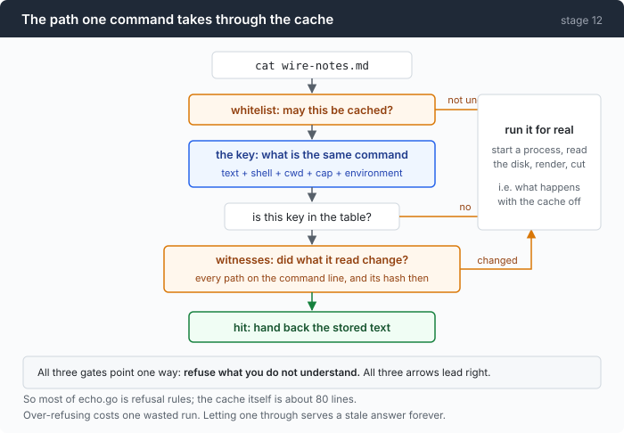
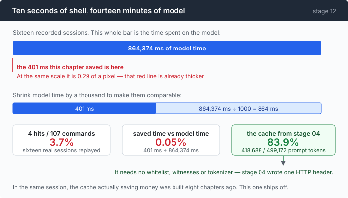

# Stage 12: Echo — working out what a cache is worth before writing it

[11](../../11-malformed/doc/README.md) → `12`

> Replayed against sixteen recorded sessions, this cache would have hit **4
> times in 107 commands** and saved **401 ms** — against 864,374 ms of model time
> in those same sessions. It ships switched off, and the audit that says so cost
> nothing to run.

---

## The problem

Four agents from stage 07 start at once and all four run `cat go.mod`. A test
suite runs three times in one session. A `ls -la` from turn 2 gets run again at
turn 14 because a compaction removed the answer.

The cheapest tool call is the one you do not make, and the fix is obvious: cache
the result.

That is where most people start writing. This chapter starts somewhere else,
because there is a much cheaper question available first — **what would it have
been worth?** — and every trace from every previous chapter is sitting there,
with every command and its duration already recorded.

---

## The idea

Two halves, in this order.

**Audit first.** Replay the `command_end` events from traces you already have
through a cold cache that runs nothing. Count the hits. No API key, no model
call, no process started. [Part 1](1-audit.md).

**Then build it, if the number justifies it.** Which means deciding what counts
as the same command, and how to know whether what it read has changed.



Three gates, all pointing the same way: **refuse what you do not understand.**
Which is why most of the file is refusal rules and the cache itself is about
eighty lines. [Part 2](2-witness.md).

**Then wire it in and default it off**, with a panel line that prints zeros —
because a cache that never hits is behaviourally identical to one that works.
[Part 3](3-off.md).

---

## Building it

| Part | What it answers |
|---|---|
| [1 · the audit](1-audit.md) | what would this have been worth, on traces you already have |
| [2 · key and witnesses](2-witness.md) | what is the same command, and did what it read change |
| [3 · off by default](3-off.md) | where the lookup goes, and why the panel prints 0 |

The order is the argument. Every part after the first exists because the first
one's number was small enough to make the rest a study rather than a feature.

---

## Run it

The audit needs nothing configured — no key, no provider, no network:

```sh
go build -o agent ./12-echo/code
./agent --cache-audit traces/*.jsonl
```

Then the cache itself, on the one workload where it does pay:

```sh
cd sandbox && set -a && . ../.env && set +a
../agent --yolo --cache -p "have three subagents each summarise a different third of wire-notes.md"
```

**What to watch for:** the `result cache:` line in the session summary. On the
fan-out task it reads 12 hits from 56 lookups. On an ordinary session it reads
zeros, and printing the zeros is deliberate — see part 3.

---

## Measured

```
TOTAL                       107      4     94      0      9      401ms

hit rate 3.7% of 107 commands · 21.0kB of output not re-read · 401ms of command
time not re-run
```

And the number that decides the chapter — the same sixteen traces, from the
other side:

| | |
|---|---|
| commands run | 107 |
| total command time | 10,041 ms |
| median command | 92 ms |
| model calls | 173 |
| total model time | **864,374 ms** |



Ten seconds of shell against fourteen minutes of model. **Commands are 1.2% of
the two added together**, so a cache that eliminated *every* command would make
a session 1.2% faster — and the achievable 3.7% of that is four hundredths of
one percent.

The best case this chapter could construct — four agents reading one file at
once — reaches a **21% hit rate** and still comes to **0.3% of model time**.

And in that same session, **418,688 of 499,172 prompt tokens (83.9%) were served
by stage 04's provider prompt cache.** More than two hundred times as much work,
from a feature that needed one HTTP header and no whitelist, no witness set and
no tokenizer.

> The expensive repetition in an agent is on the wire, not in the shell. The
> instinct that reaches for a result cache is pointing at the wrong one of the
> two caches available.

Which is why the flag defaults to off, and why the three parts below are worth
reading anyway: the *method* — audit before you build, then measure the thing you
built against the thing that was already working — is the part that transfers.

---

## Next

This is the last chapter that exists.

The [README](../../README.md) lists stages 13 through 19 as planned: resuming a
session from its trace, measuring what compaction actually loses, memory that
knows when it has gone stale, the budget for what a subagent is told, the P95
rather than the mean, four metrics off the trace, and MCP written from scratch
over stdio.

Each one has the same shape as this chapter: a feature everybody ships, with a
number attached that nobody publishes.
