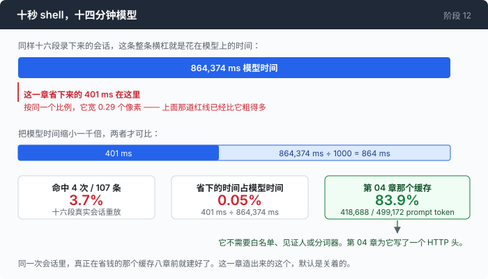

# 阶段 12：回声 —— 在动手写一个缓存之前，先算出它值多少

[00](../../00-loop/doc/README_zh.md) → 01 → 02 → 03 → 04 → 05 → 06 → 07 → 08 → 09 → 10 → [11](../../11-malformed/doc/README_zh.md) → `12`

> 这一章造了一个结果缓存，量了一遍，然后把它默认关掉。四次命中、107 条命令、省下 401 毫秒 —— 而同一批会话在模型上花了 864,374 毫秒。真正值钱的不是这个功能，是那个能在写它之前就算清楚的办法。

---

## 问题

第 11 章之后，到达 bash 的每一条命令都是通过了校验的那一条。现在看看它们都是些什么。

你让 agent 在一个仓库里干了二十分钟，任务做完了，你往上翻终端。

`ls -la` 出现了四次。`sed -n '1,150p' wire-notes.md` 出现了两次，中间隔了四十轮。你让四个子 agent 同时去看同一个文件，四条一模一样的读命令在几毫秒之内先后落到同一块磁盘上。

这里面没有一次是模型犯错。每一次它都真的需要那些字节：中间压缩过一回，先前读到的东西已经不在上下文里了；四个子 agent 各有各的对话，谁也不知道另外三个刚刚读过什么。

但每一次你都付了钱：起一个进程，读一次磁盘，再把同样的输出灌回上下文。如果那个文件在两次之间没变过，第二次跑出来的字节和第一次逐字节相同。

于是下一步显然得不用想：把命令的输出存起来，下次直接给回去。也正因为不用想，你不会去问它到底值多少。

而这个功能有一个很不好的性质：**一个从来不命中的缓存，和一个正常工作的缓存，从外面看一模一样。** 答案是对的，没有报错，日志里什么都没有，测试全绿。

有人报告过这样一件事（这条是别处的经验，这个仓库没有它的 trace）：一条 `git log --name-only` 挂在 15 秒的过期时间后面，而调用方每 30 秒重取一次。每次取的时候那条记录都刚好已经过期，命中率是**零**，那条 0.3 秒的命令每一次都真的跑了。这样跑了**几个月**。没有错误答案，没有异常，日志里一行都没有 —— 所以没有人发现。

这一章要解决的就是这件事：**在写一个缓存之前，先知道它值多少；写完之后，能看见它到底命中了几次。**

---

## 办法

三个问题，按这个顺序问。

| 问题 | 靠什么回答 |
|---|---|
| 它值得写吗 | 你手上已经有的 trace。每条 trace 都记着每一条命令、它的顺序、它花了多久 —— 一个缓存的收益只取决于这些。不需要 key，不需要模型，什么都不用跑 |
| 什么算同一条命令 | 一个 key：命令原文，加上所有能改变答案的东西 |
| 它读过的东西变了吗 | 一组见证人（witness）：命令行上点到的每一个路径，和它当时的内容哈希 |

第一行是这一章和其他章不一样的地方。后两行是缓存本身。


四个结果，不是两个。**miss** 是"能缓存，只是还没存过"，**refused** 是"这条命令永远不会被缓存"。把这两个都算成"没命中"，你就看不出一段全是 refused 的会话意味着什么 —— 那说明规则太窄，配不上这台机器上正在干的活，是另一个完全不同的问题。

整个缓存的实现大约 80 行。[`echo.go`](../code/echo.go) 剩下的篇幅全是那些**拒绝**规则，以及解释它们为什么长这样的注释。

---

## 怎么做的

一句话的想法，三个部分。第一部分决定要不要写，后两部分是写出来之后的事。

**[第 1 部分：先算，再写](1-audit_zh.md)** —— 用手上已有的 trace 审计一个还不存在的缓存。
一条 trace 记下了每条命令的原文、字节数、耗时和退出码，而 key 只由命令原文决定 —— 所以把这些命令重放进一个冷缓存，就能算出当时的命中率。不需要 API key。这一部分的 量一量 给出了这一章的头条数字，以及这个工具自己的三处盲区，其中一处是它**看不见自己的成功**。

**[第 2 部分：什么算同一条命令，它读的东西变了没有](2-witness_zh.md)** —— 键、白名单、见证人。
两个问题都长得像十分钟能写完的样子，两个都不是。判断"能不能缓存"要靠一个**拒绝一切它没完全看懂的东西**的分词器；判断"变了没有"不能用 `(size, mtime)` —— 这台机器上 2000 次等长改写里有 1498 次它看不见。还有一个在 Windows 上白过了四个月的断言。

**[第 3 部分：接进循环，然后把它默认关掉](3-off_zh.md)** —— 一次查询放在哪儿，以及面板为什么要打印 0。
查询放在权限闸门**之后**，不是之前。命中不发 `command_start`，因为没有进程启动过。最后是这一章的结论：最好的情况下它省了 1.107 秒，而同一次会话里第 04 章那个缓存替你省掉了 418,688 个 prompt token。

---

## 跑一下

先审计。这一步不需要 key，也不会有任何东西被执行：

```sh
go build -o agent ./12-echo/code

./agent --cache-audit sandbox/s05/*.jsonl sandbox/s10/*.jsonl
```

手上没有 trace 的话，先随便跑一段会话，加上 `--trace`，那个文件就是审计的输入。前面每一章的 trace 都能用。

然后把它真的打开：

```sh
cd sandbox
set -a && . ../.env && set +a
../agent --cache --trace t12.jsonl
```

试这两句：

1. `分三段读完 wire-notes.md，每读一段告诉我这一段讲了什么`，然后 `/compact`，然后 `再确认一遍前两段讲了什么`
2. `开三个子 agent，让它们分别从 wire-notes.md 里找出所有 JSON 字段名、所有 HTTP 状态码、所有小节标题`

**观察重点：**

- 每轮结尾那一行 `result cache: N hits / M lookups (K refused · …)`。它在**没有命中的时候也会打印**，这是整章唯一一处"零也要报"的地方 —— 因为零命中和正常工作长得一模一样。
- 命中的那一行 `[cached · 5.4kB, not run]`。它出现在原本该出现命令输出的位置，而下面没有耗时。
- 第 1 句里 `/compact` 之后那次重读。命中就是在这里发生的：模型不是在重复，它是在找回被压掉的东西。
- 第 2 句里三个子 agent 的命令挤在同一段时间里。这是这个缓存唯一明显划得来的场景，而下面的数字会告诉你"明显"是多少。
- `refused` 那个数会很大，通常比 miss 大。看一眼 `--replay t12.jsonl` 里那些 `cache_refused` 行写的理由。

---

## 量一量

十六段真实会话，107 条命令，用 `--cache-audit` 重放一遍：

```text
TOTAL                       107      4     94      0      9      401ms

hit rate 3.7% of 107 commands · 21.0kB of output not re-read · 401ms of command
time not re-run
```

四次命中，401 毫秒。逐条的表和这四次分别是怎么来的，在[第 1 部分](1-audit_zh.md)。

401 毫秒要和什么比，才知道它是多少？和同一批 trace 里模型花掉的时间比：

| | |
|---|---|
| 命令条数 | 107 |
| 命令总耗时 | 10,041 ms |
| 命令耗时中位数 | 92 ms |
| 模型调用次数 | 173 |
| 模型总耗时 | 864,374 ms |



十秒的 shell，对十四分钟的模型。两者加起来，**命令占 1.2%**。也就是说，一个能消灭**每一条**命令的完美缓存，让这些会话快 1.2%；而实际能拿到的是这 1.2% 里的 3.7%，也就是**万分之四**。

这一章能构造出的最好情况 —— 四个 agent 同时读同一个文件 —— 命中率是 **21%**，砍掉了 22.6% 的命令时间。换成整段会话，是**模型时间的 0.3%，墙上时间的 0.4%**。

而同一次会话里另一个缓存做了这些：

```text
  prompt tokens billed: 499172  (full 80484 · write 0 · read 418688)
```

**418,688 / 499,172 = 83.9% 的 prompt token 由第 04 章那个供应商侧的提示缓存供上了**，按十分之一收费。那个缓存不需要白名单，不需要见证人，不需要分词器，第 04 章一共写了一个 HTTP 头。

一个 agent 里真正贵的重复发生在**线上**，不在 shell 里。而"我在重复跑同一条命令"这个直觉，指的是两个缓存里错的那一个。

必须跟上的诚实话：**这 3.7% 来自一批被派去读东西的会话。** 十六段会话里出现过的命令程序只有六个 —— `sed`、`wc`、`cat`、`ls`、`find`、`grep`，清一色的读命令。白名单能覆盖它们几乎全部，这是样本的性质，不是这个工作负载的性质。换一批以编译、测试、git 操作为主的会话，命中率会更低，而不是更高。

---

## 接下来

这是第一部分和第二部分里最后一个已经写出来的阶段。剩下的路是第二部分自己提出来的问题，而这一章刚好又添了一个。

这一章反复用同一个动作回答问题：**把已经发生过的事重放一遍。** trace 里有命令，于是能算出缓存值多少；trace 里有 token 数，于是能算出压缩贵不贵。那么再往下一步：

**一段会话跑歪了，能退回上一步吗？** 会话是状态，工作区也是状态，两者都在往前走，而只有一个有回滚。第 13 章 倒带。

**压缩是有损的 —— 损了多少？** 第 05 章测出压缩比不压缩更贵，但没测过它到底丢了什么。第 14 章 失忆，把损失量出来。

**一条记忆什么时候该过期？** 第 05 章那个 `MEMORY.md` 里的每一行都在无限期地被相信。这一章刚好造过一种"见证人"：一个能说出"你记的那件事已经不成立了"的东西。第 15 章 腐烂。

再往后是 16 简报、17 两秒（要看 P95，不是平均值）、18 记分牌、19 借来的工具。规矩不变：一章一个想法，没有数字就不下结论 —— 包括数字说"这个功能不值得打开"的时候。
